# 🏗️ Real User Journey: Tech Stack in Action

*Follow Seamus O'Brien, Project Manager at Murphy Construction, through a typical Friday afternoon as he submits weekly evidence claims using your app*

---

## 👷 **User Profile**
**Name:** Seamus O'Brien  
**Role:** Project Manager  
**Location:** Galway Hospital Extension Project  
**Time:** Friday, 4:30 PM (deadline: 5:00 PM)  
**Device:** iPhone 13 with work gloves, 2 bars 4G signal  
**Task:** Submit €127,000 worth of concrete work evidence for weekly claim  

---

## 🗺️ **Journey Flow Visualization**

```mermaid
sequenceDiagram
    participant S as Seamus (User)
    participant CDN as Vercel CDN
    participant UI as Next.js App
    participant API as Django API
    participant Q as Django-Q
    participant R as Redis Cache
    participant DB as PostgreSQL
    participant ST as Supabase Storage
    participant AI as OpenAI/Replicate
    participant RT as Real-time

    Note over S: Friday 4:30 PM - 30 mins to deadline!
    
    rect rgb(200, 255, 200)
        Note over S,RT: Step 1: App Launch (1.2s)
        S->>CDN: Open app bookmark
        CDN-->>UI: Cached files (50ms)
        UI->>API: Validate JWT token
        API-->>UI: Valid user + project
        UI-->>S: Dashboard loads instantly
    end

    rect rgb(220, 220, 255)
        Note over S,RT: Step 2: Dashboard View (instant)
        UI->>R: Get project stats
        R-->>UI: Cached data (15ms)
        RT->>UI: Live processing status
        UI-->>S: Shows 3 items "Processing"
    end

    rect rgb(255, 220, 220)
        Note over S,RT: Step 3: Voice Upload (12s)
        S->>UI: Records 2min voice message
        UI->>API: Upload 8MB voice file
        API->>ST: Store encrypted file
        API->>Q: Queue transcription job
        Q->>R: Add to priority queue
        UI-->>S: "Uploading..." → "Processing..."
    end

    rect rgb(255, 255, 200)
        Note over S,RT: Step 4: AI Processing (30s)
        Q->>AI: Transcribe voice (Whisper)
        AI-->>Q: Irish accent text
        Q->>AI: Extract data (GPT-4)
        AI-->>Q: Structured JSON (94% confidence)
        Q->>DB: Save processed content
        Q->>RT: Broadcast progress updates
        RT-->>UI: Real-time progress bar
        UI-->>S: "Processing complete! 94%"
    end

    rect rgb(200, 255, 255)
        Note over S,RT: Step 5: Review & Correct (45s)
        S->>UI: Fix "Quinns" → "Quinn's"
        UI->>API: Optimistic update
        API->>DB: Save corrections
        S->>UI: Add truck receipt photo
        UI->>ST: Store receipt image
        UI-->>S: Clean corrected data
    end

    rect rgb(255, 200, 255)
        Note over S,RT: Step 6: PDF Generation (45s)
        S->>UI: "Generate Weekly Package"
        UI->>API: Request PDF creation
        API->>Q: Queue PDF generation
        Q->>DB: Fetch all week's evidence
        Q->>Q: Generate 12-page PDF
        Q->>ST: Store final PDF
        Q->>RT: Progress updates
        RT-->>UI: "Generating page 3 of 12..."
        UI-->>S: "PDF Ready!"
    end

    rect rgb(200, 200, 200)
        Note over S,RT: Step 7: Submission (15s)
        S->>CDN: Download PDF
        CDN-->>S: Fast download (3s)
        S->>S: Email to contractor
        API->>DB: Mark as "Submitted"
        RT->>UI: Notify validator in Dublin
    end

    Note over S: 4:52 PM - Success! 8 minutes to spare 🎉
```



---

## 🏗️ **System Architecture During User Journey**

```mermaid
graph TB
    subgraph "User Layer"
        S[👷 Seamus<br/>iPhone + Gloves<br/>2 bars 4G]
    end
    
    subgraph "Frontend - Vercel CDN"
        CDN[🌍 Dublin Edge Server<br/>50ms response]
        UI[📱 Next.js App<br/>SSR + React Query]
    end
    
    subgraph "API Layer - Railway Ireland"
        API[🔧 Django REST<br/>EU-West Region]
        ADMIN[👩‍💼 Django Admin<br/>Validator Interface]
    end
    
    subgraph "Processing - Background"
        Q[⚡ Django-Q Workers<br/>Voice Processing]
        R[🚀 Redis Queue<br/>Friday Rush Handler]
    end
    
    subgraph "Data - Supabase Dublin"
        DB[(📊 PostgreSQL<br/>Evidence Records)]
        ST[📁 Object Storage<br/>Voice + Photos + PDFs]
        RT[📡 Real-time<br/>Progress Updates]
    end
    
    subgraph "AI Services"
        AI1[🎯 OpenAI Whisper<br/>Irish Accent Processing]
        AI2[🧠 GPT-4<br/>Construction Data Extraction]
        AI3[🔄 Replicate<br/>Backup Processing]
    end
    
    subgraph "External"
        WA[📲 WhatsApp Business<br/>Voice Messages]
        EMAIL[📧 Email System<br/>PDF Delivery]
    end

    S -->|1. App Launch| CDN
    CDN -->|Cached Files| UI
    UI <-->|2. Dashboard| API
    API <-->|Cached Stats| R
    
    S -->|3. Voice Upload| UI
    UI -->|File Upload| API
    API -->|Store File| ST
    API -->|Queue Job| Q
    Q -->|High Priority| R
    
    Q -->|4. Transcribe| AI1
    Q -->|Extract Data| AI2
    Q -.->|Backup| AI3
    Q -->|Save Results| DB
    Q -->|Progress| RT
    RT -->|Updates| UI
    
    UI <-->|5. Corrections| API
    API -->|Audit Trail| DB
    
    API -->|6. PDF Request| Q
    Q -->|Fetch Data| DB
    Q -->|Store PDF| ST
    
    CDN <-->|7. Download| S
    S -->|Email PDF| EMAIL
    
    WA -.->|Future| API
    
    classDef userLayer fill:#e1f5fe
    classDef frontend fill:#f3e5f5
    classDef api fill:#fff3e0
    classDef processing fill:#ffebee
    classDef data fill:#e8f5e8
    classDef ai fill:#fff8e1
    classDef external fill:#fafafa
    
    class S userLayer
    class CDN,UI frontend
    class API,ADMIN api
    class Q,R processing
    class DB,ST,RT data
    class AI1,AI2,AI3 ai
    class WA,EMAIL external
```



---

## 🚨 **Failure Scenarios Visualization**


---

## 📱 **Step-by-Step Journey**

### **Step 1: App Launch** ⏱️ *0 seconds*

**👤 What Seamus Does:**
- Opens app bookmark on iPhone while walking from concrete pour area
- Still wearing work gloves, taps with knuckle

**🔧 What Your Tech Stack Does:**
- **CDN (Vercel)**: Serves cached app files from Dublin edge server (50ms instead of 200ms)
- **SSR (Next.js)**: Server pre-renders main dashboard page for instant display
- **JWT**: Validates stored authentication token without server round-trip
- **Zustand**: Loads remembered state (Galway Hospital project already selected)

**✅ Success Result:** App loads in 1.2 seconds despite poor signal  
**❌ What if it fails:** 
- No CDN: 8-second load from US server = Seamus gets frustrated, might give up
- No SSR: Blank screen for 5 seconds while JavaScript loads = looks broken
- No JWT: Forced to login again = 30 seconds wasted entering password with gloves

---

### **Step 2: Project Dashboard** ⏱️ *2 seconds*

**👤 What Seamus Does:**
- Sees dashboard showing current week's progress
- Notices 3 voice messages from morning still "Processing"
- Checks time: 4:32 PM (28 minutes left!)

**🔧 What Your Tech Stack Does:**
- **React Query**: Displays cached project data instantly (no server call needed)
- **Real-time (Supabase)**: Shows live processing status of morning voice messages
- **Django-Q + Redis**: Background workers still processing morning's 3-minute voice messages
- **Redis Cache**: Project stats loaded from memory in 15ms

**✅ Success Result:** Instant dashboard view with real-time processing status  
**❌ What if it fails:**
- No React Query: 3-second loading spinner for project data = wasted time
- No Real-time: Shows "Processing" for completed items = confusing status
- No Redis Cache: 2-second database query = feels sluggish

---

### **Step 3: Voice Message Upload** ⏱️ *15 seconds*

**👤 What Seamus Does:**
- Taps "Add Evidence" button
- Records 2-minute voice message: *"Seamus here, Friday afternoon. Just finished pouring 45 cubic meters of C35 concrete for the east wing foundation. Truck number 4472 from Quinn's. Temperature was 12 degrees, perfect conditions. Value is €12,500 for today's pour..."*
- Taps upload while walking toward site office

**🔧 What Your Tech Stack Does:**
- **Django REST API**: Receives multipart file upload via secure endpoint
- **Supabase Storage**: Stores 8MB voice file with encryption in EU-West region
- **Django-Q**: Immediately queues transcription job in Redis
- **Redis**: Adds job to priority queue (Friday afternoon = high priority)
- **React Query**: Optimistically updates UI showing "Uploading..." status
- **Webhook**: Triggers background processing chain

**✅ Success Result:** Upload completes in 12 seconds, processing starts immediately  
**❌ What if it fails:**
- No Supabase Storage: File upload fails = lost voice message, manual re-recording
- No Django-Q: Blocks UI for 45 seconds during processing = unusable app
- No Redis Queue: Jobs process one-by-one = other users wait hours on Friday
- No Optimistic Updates: UI shows nothing until processing done = feels broken

---

### **Step 4: AI Processing Chain** ⏱️ *30 seconds*

**👤 What Seamus Does:**
- Continues walking to site office
- Sees progress bar showing "Transcribing audio..."
- Starts preparing photo of concrete truck receipt

**🔧 What Your Tech Stack Does:**
- **OpenAI Whisper**: Transcribes 2-minute Irish accent voice to text
- **GPT-4**: Extracts structured data:
  ```json
  {
    "who": "Seamus O'Brien",
    "what": "C35 concrete pour", 
    "amount": 12500,
    "quantity": "45 cubic meters",
    "location": "East wing foundation",
    "supplier": "Quinn's Concrete",
    "truck": "4472",
    "conditions": "12 degrees, perfect"
  }
  ```
- **Confidence Scoring**: 94% overall confidence (high enough for auto-approval)
- **Real-time Updates**: Pushes progress to Seamus's phone via WebSocket
- **Database**: Saves processed content to PostgreSQL with pgvector embeddings

**✅ Success Result:** Processing completes with 94% confidence, auto-approved  
**❌ What if it fails:**
- OpenAI Outage: Replicate backup kicks in (adds 20 seconds but still works)
- Low Confidence: Goes to validation queue = might not be approved by 5pm deadline
- No Real-time: Seamus keeps refreshing to check status = poor UX
- Database Failure: Processing completes but data lost = total failure

---

### **Step 5: Review & Correction** ⏱️ *45 seconds*

**👤 What Seamus Does:**
- Receives real-time notification: "Processing complete! 94% confidence"
- Reviews extracted data in clean interface
- Notices GPT-4 missed supplier name (Quinn's vs Quinns)
- Quickly corrects "Quinns" to "Quinn's Concrete" using dropdown
- Adds truck receipt photo from phone camera

**🔧 What Your Tech Stack Does:**
- **Radix UI**: Provides accessible form components that work with work gloves
- **TypeScript**: Ensures corrected data matches exact schema format
- **Optimistic Updates**: UI immediately shows corrections before server confirms
- **Supabase Storage**: Stores receipt photo with automatic optimization
- **Django ORM**: Updates processed_content table with corrections
- **Middleware**: Logs all changes for audit trail (who changed what when)

**✅ Success Result:** Clean, intuitive review interface with instant corrections  
**❌ What if it fails:**
- No Radix UI: Custom forms break with gloves = can't make corrections
- No TypeScript: Correction format error = database rejection
- No Optimistic Updates: Every change requires server round-trip = sluggish feeling
- No Audit Trail: Can't prove who made corrections = compliance failure

---

### **Step 6: Evidence Package Generation** ⏱️ *1 minute*

**👤 What Seamus Does:**
- Taps "Add to Weekly Package"
- Sees package now contains €127,000 total value (5 items this week)
- Clicks "Generate PDF Package"
- Time check: 4:48 PM (12 minutes left!)

**🔧 What Your Tech Stack Does:**
- **Django**: Queries all evidence for current week with proper data validation
- **PDF Generator**: Creates professional 12-page evidence package with:
  - Cover page with project details
  - Item-by-item breakdown with confidence scores
  - Voice transcriptions with corrections highlighted
  - Supporting photos and receipts
  - Digital signatures and timestamps
- **Background Processing**: PDF generation runs in Django-Q worker
- **Real-time**: Shows progress: "Generating page 3 of 12..."
- **Supabase Storage**: Saves completed PDF with secure download URL

**✅ Success Result:** Professional PDF ready in 45 seconds  
**❌ What if it fails:**
- PDF Generation Crash: Week's work lost, manual recreation takes hours
- No Background Processing: UI frozen for 2 minutes = appears crashed
- No Progress Updates: Black box processing = user assumes app is broken
- Storage Failure: PDF generates but can't be downloaded = unusable

---

### **Step 7: Final Submission** ⏱️ *15 seconds*

**👤 What Seamus Does:**
- Downloads PDF to phone (auto-opens in preview)
- Quick scan: all data looks correct, professional format
- Emails PDF to main contractor: construction@hospital-project.ie
- Time: 4:52 PM - submitted with 8 minutes to spare! 🎉

**🔧 What Your Tech Stack Does:**
- **CDN**: PDF downloads from nearest edge server in 3 seconds
- **Email Integration**: Secure PDF sharing with audit trail
- **Database**: Marks package as "Submitted" with timestamp
- **Real-time**: Notifies Sarah (validator in Dublin) of completed submission
- **Analytics**: Records successful submission for project metrics
- **Backup**: Automatically creates redundant copies across regions

**✅ Success Result:** Successful submission with full audit trail and backup  
**❌ What if it fails:**
- Download Failure: Can't access PDF = missed deadline despite completed work
- Email Failure: PDF created but can't be sent = manual intervention needed
- No Audit Trail: Can't prove submission time = potential legal issues
- No Backup: Single point of failure for critical business document

---

## 📊 **Journey Summary**

### **Total Time:** 4 minutes, 52 seconds
### **User Satisfaction:** ✅ High - deadline met with time to spare
### **Business Value:** €127,000 claim submitted professionally and on time

---

## 🔥 **Tech Stack Impact Analysis**

### **Without Your Smart Tech Stack:**
- **Total Time:** 45+ minutes (manual transcription, formatting, validation)
- **Error Rate:** High (manual data entry mistakes)
- **Deadline Risk:** Very likely to miss 5pm cutoff
- **User Experience:** Frustrating, error-prone, stressful

### **With Your Tech Stack:**
- **Total Time:** Under 5 minutes
- **Error Rate:** Minimal (94% AI accuracy + human verification)  
- **Deadline Compliance:** Reliable submission with buffer time
- **User Experience:** Smooth, professional, confidence-inspiring

---

## 🚨 **Failure Cascade Scenarios**

### **Scenario A: "The Friday Afternoon Disaster"**
**Multiple failures at worst time:**

1. **CDN Down** → 8-second app loads → Users get impatient
2. **OpenAI Overloaded** → Replicate backup works but slower → Anxiety builds  
3. **Real-time Connection Lost** → Users refresh constantly → Server overload
4. **Result:** Mass panic at 4:55pm, support calls flooding in

### **Scenario B: "The Authentication Nightmare"**
**JWT token issues:**

1. **Token Expires** → User forced to login again
2. **With Work Gloves** → Can't type password accurately  
3. **Password Reset** → Email delayed in poor signal
4. **Result:** Seamus locked out, misses deadline, €127K claim delayed

### **Scenario C: "The Data Loss Horror**
**Storage/processing failures:**

1. **Voice Upload Fails** → No indication to user → Thinks it worked
2. **Processing Queue Crashes** → Silent failure → No recovery
3. **Database Corruption** → Week's work vanishes → No backup
4. **Result:** Catastrophic data loss, angry customers, reputation damage

---

## 📊 **Performance Metrics Dashboard**


---

## 💡 **Key Insights**

### **Why Each Component Is Critical:**
1. **Speed = Deadline Compliance** (CDN, SSR, caching)
2. **Reliability = Business Continuity** (backups, failovers, queues)
3. **UX = User Adoption** (real-time updates, optimistic UI, error handling)
4. **Data Integrity = Legal Compliance** (audit trails, validation, security)

### **The Friday Effect:**
Every technical decision must consider the weekly rush:
- **4:30-5:00 PM Friday = 60% of weekly traffic**
- **High stress + poor mobile signal = technical challenges amplified**
- **Single failure = multiple missed deadlines = business impact**

### **Visual Proof Points:**
- **Sequence Diagram**: Shows real-time coordination between 9 systems
- **Architecture Diagram**: Illustrates why geographic distribution matters
- **Failure Flow**: Demonstrates 6 potential failure points + 4 recovery systems
- **Performance Charts**: Quantifies the 4m 52s total journey time

---

## 🎯 **Diagram Takeaways**

### **From Sequence Diagram:**
- **9 systems** coordinate seamlessly in under 5 minutes
- **Real-time feedback** keeps user informed throughout
- **Background processing** prevents UI blocking
- **Geographic optimization** (Dublin servers) reduces latency

### **From Architecture Flow:**
- **Hybrid deployment** strategy maximizes strengths of each platform
- **Multiple redundancy layers** protect against single points of failure
- **EU data residency** ensures GDPR compliance
- **Scalable queue system** handles Friday rush periods

### **From Failure Analysis:**
- **6 major failure points** each have specific recovery strategies
- **Critical path** shows where failures hurt most (authentication, processing)
- **Backup systems** automatically engage without user awareness
- **Manual fallbacks** exist for catastrophic scenarios

---

*These diagrams prove your tech stack isn't just about cool technology - it's a precisely orchestrated system enabling Seamus to reliably meet critical business deadlines under pressure, while maintaining professional standards in a demanding industry.*