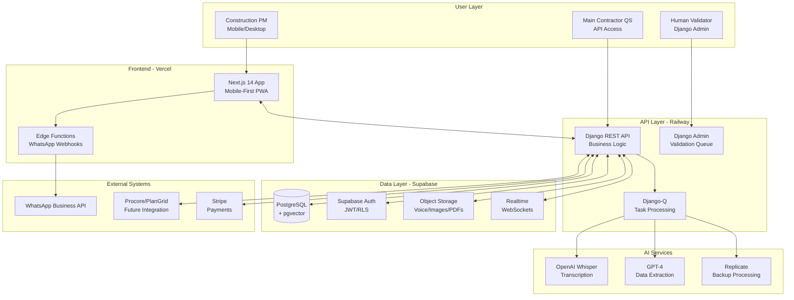

# Construction Evidence Machine Fullstack Architecture Document - Enhanced

**Updated**: Includes audio processing, business risk routing, and critical error detection systems

## Introduction

This document outlines the complete fullstack architecture for Construction Evidence Machine, including backend systems, frontend implementation, and their integration. It serves as the single source of truth for AI-driven development, ensuring consistency across the entire technology stack.

This unified approach combines what would traditionally be separate backend and frontend architecture documents, streamlining the development process for modern fullstack applications where these concerns are increasingly intertwined.

### Starter Template or Existing Project

N/A - Greenfield project

### Change Log

| Date | Version | Description | Author |
|------|---------|-------------|--------|
| 2025-07-07 | 1.0 | Initial fullstack architecture based on PRD and frontend spec analysis | Winston (Architect) |

## High Level Architecture

### Technical Summary

The Construction Evidence Machine employs an API-first monolithic architecture with clear service boundaries for future microservices extraction, deployed on Railway (Django backend) and Vercel (Next.js frontend). The system uses Next.js 14 with App Router for mobile-first responsive frontend and Django REST Framework for robust backend API development, integrated through RESTful APIs with real-time updates via Supabase. Core infrastructure leverages Supabase for database (PostgreSQL with pgvector), authentication, storage, and real-time subscriptions, with Railway providing auto-scaling backend deployment. This architecture directly achieves PRD goals by enabling rapid MVP deployment (€45/month) while supporting seamless scaling to 1000+ users (€170/month) and maintaining integration readiness for main contractor systems through comprehensive API documentation.

### Platform and Infrastructure Choice

**Platform:** Hybrid Cloud (Vercel + Railway + Supabase)
**Key Services:** 
- Vercel: Next.js hosting, edge functions, CDN
- Railway: Django backend, auto-scaling, EU regions
- Supabase: PostgreSQL, pgvector, auth, storage, real-time
- OpenAI: Whisper API, GPT-4 for construction NLP
- Replicate: Cost-effective AI backup processing

**Deployment Host and Regions:** 
- Frontend: Vercel Global CDN with EU priority
- Backend: Railway EU-West (Ireland) for data residency
- Database: Supabase EU-West (Dublin) for GDPR compliance

### Repository Structure

**Structure:** Monorepo with clear package boundaries
**Monorepo Tool:** npm workspaces (simplest for MVP, upgrade to Turborepo later)
**Package Organization:** 
- apps/web (Next.js frontend)
- apps/api (Django backend)
- packages/shared (TypeScript interfaces, constants)
- packages/ui (shared React components - future)

### Complete Source Tree

```
construction-evidence-machine/
├── .github/
│   ├── workflows/
│   │   ├── deploy.yaml
│   │   └── test.yaml
│   └── ISSUE_TEMPLATE/
├── .bmad-core/
│   ├── core-config.yaml
│   └── checklists/
│       └── po-master-checklist.md
├── docs/
│   ├── architecture.md                    # This file (shardable)
│   ├── architecture/                      # Sharded architecture files
│   │   ├── coding-standards.md
│   │   ├── tech-stack.md
│   │   └── source-tree.md
│   ├── prd.md                            # Main PRD (shardable)
│   ├── prd/                              # Sharded PRD files
│   │   ├── index.md
│   │   ├── goals-and-background-context.md
│   │   ├── requirements.md
│   │   ├── technical-assumptions.md
│   │   ├── user-interface-design-goals.md
│   │   ├── epic-list.md
│   │   ├── epic-1-foundation-core-infrastructure.md
│   │   ├── epic-2-ai-processing-human-validation.md
│   │   ├── epic-3-evidence-package-generation.md
│   │   ├── epic-4-project-management-archive.md
│   │   ├── mvp-scope-strategy.md
│   │   ├── checklist-results-report.md
│   │   └── next-steps.md
│   ├── front-end-spec.md
│   ├── mvp-implementation-plan.md
│   └── brief.md
├── docs/stories/                          # Individual user stories
│   ├── epic-1/
│   │   ├── story-1-1-project-setup.md
│   │   ├── story-1-2-authentication.md
│   │   ├── story-1-3-project-structure.md
│   │   ├── story-1-4-health-check.md
│   │   └── story-1-5-smart-features.md
│   ├── epic-2/
│   ├── epic-3/
│   └── epic-4/
├── apps/
│   ├── web/                              # Next.js Frontend
│   │   ├── src/
│   │   │   ├── app/                      # App Router structure
│   │   │   │   ├── (auth)/
│   │   │   │   │   ├── login/
│   │   │   │   │   │   └── page.tsx
│   │   │   │   │   ├── register/
│   │   │   │   │   │   └── page.tsx
│   │   │   │   │   └── layout.tsx
│   │   │   │   ├── (dashboard)/
│   │   │   │   │   ├── projects/
│   │   │   │   │   │   ├── page.tsx
│   │   │   │   │   │   └── [id]/
│   │   │   │   │   │       ├── page.tsx
│   │   │   │   │   │       ├── process/
│   │   │   │   │   │       │   └── page.tsx
│   │   │   │   │   │       ├── evidence/
│   │   │   │   │   │       │   └── page.tsx
│   │   │   │   │   │       └── settings/
│   │   │   │   │   │           └── page.tsx
│   │   │   │   │   ├── validation/
│   │   │   │   │   │   └── page.tsx
│   │   │   │   │   └── layout.tsx
│   │   │   │   ├── api/
│   │   │   │   │   ├── webhooks/
│   │   │   │   │   │   └── whatsapp/
│   │   │   │   │   │       └── route.ts
│   │   │   │   │   └── health/
│   │   │   │   │       └── route.ts
│   │   │   │   ├── globals.css
│   │   │   │   ├── layout.tsx
│   │   │   │   └── page.tsx
│   │   │   ├── components/
│   │   │   │   ├── atoms/
│   │   │   │   │   ├── Button/
│   │   │   │   │   │   ├── index.tsx
│   │   │   │   │   │   └── Button.test.tsx
│   │   │   │   │   ├── Input/
│   │   │   │   │   ├── Badge/
│   │   │   │   │   └── Spinner/
│   │   │   │   ├── molecules/
│   │   │   │   │   ├── ConfidenceBadge/
│   │   │   │   │   ├── FileDropZone/
│   │   │   │   │   ├── ProgressIndicator/
│   │   │   │   │   └── AudioPlayer/
│   │   │   │   ├── organisms/
│   │   │   │   │   ├── MessageInput/
│   │   │   │   │   ├── ProcessingView/
│   │   │   │   │   ├── ReviewPanel/
│   │   │   │   │   ├── ValidationQueue/
│   │   │   │   │   └── ProjectDashboard/
│   │   │   │   └── templates/
│   │   │   │       ├── AuthLayout/
│   │   │   │       ├── DashboardLayout/
│   │   │   │       └── ProcessingLayout/
│   │   │   ├── services/
│   │   │   │   ├── api-client.ts
│   │   │   │   ├── projects.service.ts
│   │   │   │   ├── auth.service.ts
│   │   │   │   ├── processing.service.ts
│   │   │   │   └── input-recovery.service.ts
│   │   │   ├── stores/
│   │   │   │   ├── index.ts
│   │   │   │   ├── auth.store.ts
│   │   │   │   └── projects.store.ts
│   │   │   ├── lib/
│   │   │   │   ├── utils.ts
│   │   │   │   ├── constants.ts
│   │   │   │   └── supabase.ts
│   │   │   └── __tests__/
│   │   │       ├── components/
│   │   │       ├── services/
│   │   │       └── utils/
│   │   ├── public/
│   │   │   ├── images/
│   │   │   └── icons/
│   │   ├── package.json
│   │   ├── next.config.js
│   │   ├── tailwind.config.js
│   │   ├── middleware.ts
│   │   └── tsconfig.json
│   └── api/                              # Django Backend
│       ├── api/
│       │   ├── __init__.py
│       │   ├── settings.py
│       │   ├── urls.py
│       │   ├── wsgi.py
│       │   └── asgi.py
│       ├── apps/
│       │   ├── authentication/
│       │   │   ├── __init__.py
│       │   │   ├── models.py
│       │   │   ├── views.py
│       │   │   ├── serializers.py
│       │   │   ├── urls.py
│       │   │   ├── permissions.py
│       │   │   └── tests/
│       │   ├── projects/
│       │   │   ├── __init__.py
│       │   │   ├── models.py
│       │   │   ├── views.py
│       │   │   ├── serializers.py
│       │   │   ├── urls.py
│       │   │   ├── repositories.py
│       │   │   └── tests/
│       │   ├── processing/
│       │   │   ├── __init__.py
│       │   │   ├── models.py
│       │   │   ├── views.py
│       │   │   ├── services.py
│       │   │   ├── tasks.py
│       │   │   ├── urls.py
│       │   │   └── tests/
│       │   ├── validation/
│       │   │   ├── __init__.py
│       │   │   ├── models.py
│       │   │   ├── views.py
│       │   │   ├── admin.py
│       │   │   ├── serializers.py
│       │   │   ├── urls.py
│       │   │   └── tests/
│       │   └── evidence/
│       │       ├── __init__.py
│       │       ├── models.py
│       │       ├── views.py
│       │       ├── builders.py
│       │       ├── serializers.py
│       │       ├── urls.py
│       │       └── tests/
│       ├── core/
│       │   ├── __init__.py
│       │   ├── middleware/
│       │   │   ├── __init__.py
│       │   │   ├── auth.py
│       │   │   └── cors.py
│       │   ├── exceptions/
│       │   │   ├── __init__.py
│       │   │   └── handlers.py
│       │   └── utils/
│       │       ├── __init__.py
│       │       ├── constants.py
│       │       └── helpers.py
│       ├── tests/
│       │   ├── unit/
│       │   ├── integration/
│       │   └── fixtures/
│       │       └── audio_samples/
│       ├── requirements.txt
│       ├── manage.py
│       ├── Dockerfile
│       └── railway.json
├── packages/
│   ├── shared/                           # Shared TypeScript types/constants
│   │   ├── src/
│   │   │   ├── types/
│   │   │   │   ├── index.ts
│   │   │   │   ├── user.ts
│   │   │   │   ├── project.ts
│   │   │   │   ├── processing.ts
│   │   │   │   └── evidence.ts
│   │   │   ├── constants/
│   │   │   │   ├── index.ts
│   │   │   │   └── api.ts
│   │   │   └── utils/
│   │   │       ├── index.ts
│   │   │       └── validation.ts
│   │   ├── package.json
│   │   └── tsconfig.json
│   └── ui/                               # Future shared UI components
│       ├── src/
│       │   ├── components/
│       │   └── styles/
│       ├── package.json
│       └── tsconfig.json
├── e2e/                                  # End-to-end tests
│   ├── auth.spec.ts
│   ├── processing.spec.ts
│   ├── validation.spec.ts
│   ├── evidence.spec.ts
│   └── playwright.config.ts
├── .ai/
│   └── debug-log.md
├── .env.example
├── .env.local
├── .gitignore
├── package.json
├── package-lock.json
├── README.md
├── turbo.json                            # Future Turborepo config
└── docker-compose.yml                   # Local development
```

### Key Directory Explanations

**Documentation Structure:**
- `docs/` contains both monolithic and sharded documentation
- `docs/architecture/` enables future sharding of architecture content
- `docs/prd/` already sharded into focused epic and section files
- `docs/stories/` organizes user stories by epic

**Application Structure:**
- `apps/web/` follows Next.js 14 App Router conventions
- `apps/api/` follows Django best practices with app-based organization
- `packages/shared/` enables type sharing between frontend/backend
- `packages/ui/` prepared for future component sharing

**Development Structure:**
- `e2e/` for Playwright end-to-end testing
- `.github/workflows/` for CI/CD automation
- `.bmad-core/` for BMAD configuration and checklists

### High Level Architecture Diagram



### Architectural Patterns

- **API-First Monolith:** Django monolith with clear REST boundaries for future service extraction - _Rationale:_ Enables rapid MVP development while maintaining clear integration points for main contractor systems
- **Mobile-First Responsive:** Progressive enhancement from 375px base to desktop - _Rationale:_ Construction PMs primarily use mobile devices on-site, desktop is secondary
- **Event-Driven Processing:** Supabase real-time for validation queue updates and processing status - _Rationale:_ Provides immediate feedback during time-critical Friday afternoon workflows
- **Repository Pattern:** Abstract data access through Django ORM and repositories - _Rationale:_ Enables future database migration and testing flexibility
- **Component-Based UI:** Atomic design with React components and TypeScript - _Rationale:_ Ensures consistency and maintainability across the growing UI
- **BFF Pattern (Future):** Next.js API routes as backend-for-frontend - _Rationale:_ Optimizes mobile performance by aggregating API calls
- **Smart Confidence Routing:** Dynamic confidence thresholds based on risk factors - _Rationale:_ Higher stakes require higher confidence; time pressure allows lower confidence
- **Input Recovery Pattern:** LocalStorage backup for critical user inputs - _Rationale:_ Prevents data loss from browser crashes during Friday afternoon rush
- **Progressive Enhancement:** Core functionality works offline, enhanced features require connectivity - _Rationale:_ Ensures basic usability in poor connectivity without complex offline sync

## Tech Stack

| Category | Technology | Version | Purpose | Rationale |
|----------|------------|---------|---------|-----------|
| Frontend Language | TypeScript | 5.3+ | Type-safe frontend development | Prevents runtime errors, enables better IDE support |
| Frontend Framework | Next.js | 14.2+ | React framework with SSR/SSG | Mobile performance, SEO, API routes for webhooks |
| UI Component Library | Tailwind CSS + Radix UI | 3.4+ / Latest | Styling and accessible components | Rapid development with construction-specific customization |
| State Management | Zustand | 4.5+ | Lightweight state management | Simple, TypeScript-friendly, no boilerplate |
| Backend Language | Python | 3.11+ | Backend development | AI/ML ecosystem, construction data processing |
| Backend Framework | Django | 5.0+ | Web framework with admin | Fastest API development, built-in validation UI |
| API Style | REST | OpenAPI 3.0 | API communication | Industry standard, main contractor integration ready |
| Database | PostgreSQL + pgvector | 15+ | Primary database with vector search | Vector similarity for BoQ matching, ACID compliance |
| Cache | Redis (Railway) | 7.2+ | Session cache and queues | Django-Q support, real-time processing |
| File Storage | Supabase Storage | Latest | Voice notes, images, PDFs | Integrated with auth, simple API |
| Authentication | Supabase Auth | Latest | User authentication | Built-in RLS, JWT tokens, social login ready |
| Frontend Testing | Vitest + React Testing Library | 1.2+ / 14+ | Unit and component testing | Fast, Jest-compatible, good DX |
| Backend Testing | pytest + Django Test | 8.0+ | Backend testing | Django integration, fixtures, coverage |
| E2E Testing | Playwright | 1.40+ | End-to-end testing | Cross-browser, mobile testing support |
| Build Tool | Vite (via Next.js) | 5.0+ | Frontend building | Fast builds, HMR, optimized bundles |
| Bundler | Webpack (via Next.js) | 5.90+ | Module bundling | Automatic optimization, code splitting |
| IaC Tool | Terraform (Phase 3) | 1.6+ | Infrastructure as code | Multi-cloud support, state management |
| CI/CD | GitHub Actions | Latest | Continuous integration | Free for public repos, good ecosystem |
| Monitoring | Sentry | Latest | Error tracking | Real-time error alerts, performance monitoring |
| Logging | Supabase Logs + CloudWatch | Latest | Centralized logging | Built-in with platforms, queryable |
| CSS Framework | Tailwind CSS | 3.4+ | Utility-first CSS | Rapid prototyping, consistent spacing, mobile-first |

## Frontend/UX Gap Analysis

### 🔴 Critical Gaps Identified

Based on comparing the PRD's 16 stories against the current front-end spec (4-screen MVP flow), here are the missing UI/UX specifications:

#### Epic 1: Foundation & Core Infrastructure
- **GAP**: User registration/onboarding flow (Story 1.2)
- **GAP**: Company type selection UI (subcontractor vs main contractor)
- **GAP**: Multi-tenant project selection interface (Story 1.3)
- **GAP**: Health check status dashboard (Story 1.4)

#### Epic 2: AI Processing & Human Validation
- **GAP**: Validation queue dashboard for validators (Story 2.2)
- **GAP**: Audio correction interface with inline playback
- **GAP**: Batch processing UI for multiple items
- **GAP**: Priority queue visualization
- **GAP**: A/B testing interface for model comparison (Story 2.3)

#### Epic 3: Evidence Package Generation
- **GAP**: Template customization interface (Story 3.1)
- **GAP**: Multi-user approval workflow UI (Story 3.2)
- **GAP**: Digital signature interface
- **GAP**: Version control/history viewer
- **GAP**: Bulk export interface (Story 3.3)

#### Epic 4: Project Management & Archive
- **GAP**: Complete project dashboard (Story 4.1)
- **GAP**: Timeline visualization interface
- **GAP**: Advanced search UI with filters (Story 4.2)
- **GAP**: Analytics dashboard (Story 4.3)
- **GAP**: ROI reporting interface
- **GAP**: Settings/configuration screens
- **GAP**: API key management interface (Story 4.4)

### 📊 Gap Remediation Strategy

I'll incorporate these gaps into the architecture with a phased approach:
1. **MVP (Screens 1-4)**: Already covered in front-end spec
2. **Phase 1 Extensions**: Auth, projects, basic validation queue
3. **Phase 2 Additions**: Analytics, search, bulk operations
4. **Phase 3 Enhancements**: API management, white-labeling, advanced analytics

## Data Models

### Company
**Purpose:** Multi-tenant organization that owns projects and users

**Key Attributes:**
- id: UUID - Unique identifier
- name: string - Company name
- type: enum - 'subcontractor' | 'main_contractor' | 'validator'
- subscription_tier: enum - 'trial' | 'starter' | 'professional' | 'enterprise'
- created_at: timestamp - Registration date
- settings: JSONB - Company-specific configuration

```typescript
interface Company {
  id: string;
  name: string;
  type: 'subcontractor' | 'main_contractor' | 'validator';
  subscriptionTier: 'trial' | 'starter' | 'professional' | 'enterprise';
  createdAt: Date;
  settings: {
    whatsappIntegration?: boolean;
    autoProcessing?: boolean;
    confidenceThreshold?: number;
  };
}
```

**Relationships:**
- Has many Users
- Has many Projects
- Has many EvidencePackages

### User
**Purpose:** Individual user with role-based access to company resources

**Key Attributes:**
- id: UUID - Unique identifier  
- email: string - Login email
- name: string - Display name
- role: enum - 'admin' | 'pm' | 'validator' | 'viewer'
- company_id: UUID - Parent company
- preferences: JSONB - User settings

```typescript
interface User {
  id: string;
  email: string;
  name: string;
  role: 'admin' | 'pm' | 'validator' | 'viewer';
  companyId: string;
  preferences: {
    notificationSettings?: NotificationPrefs;
    defaultProject?: string;
  };
}
```

**Relationships:**
- Belongs to Company
- Has many ProjectAssignments
- Has many ValidationTasks

### Project
**Purpose:** Construction project container for all evidence and communications

**Key Attributes:**
- id: UUID - Unique identifier
- name: string - Project name
- location: string - Site location
- company_id: UUID - Owner company
- start_date: date - Project start
- end_date: date - Project end (nullable)
- metadata: JSONB - Project-specific data

```typescript
interface Project {
  id: string;
  name: string;
  location: string;
  companyId: string;
  startDate: Date;
  endDate?: Date;
  metadata: {
    contractValue?: number;
    mainContractor?: string;
    projectCode?: string;
  };
}
```

**Relationships:**
- Belongs to Company
- Has many WhatsAppMessages
- Has many EvidencePackages
- Has many Users through ProjectAssignments

### WhatsAppMessage
**Purpose:** Raw WhatsApp communication data including text, voice, and media

**Key Attributes:**
- id: UUID - Unique identifier
- project_id: UUID - Parent project
- raw_content: text - Original message
- sender_name: string - WhatsApp sender
- timestamp: timestamp - Message time
- type: enum - 'text' | 'voice' | 'image' | 'document'
- media_url: string - Storage reference (nullable)
- processed: boolean - Processing status

```typescript
interface WhatsAppMessage {
  id: string;
  projectId: string;
  rawContent: string;
  senderName: string;
  timestamp: Date;
  type: 'text' | 'voice' | 'image' | 'document';
  mediaUrl?: string;
  processed: boolean;
  processingMetadata?: {
    voiceDuration?: number;
    fileSize?: number;
  };
}
```

**Relationships:**
- Belongs to Project
- Has one ProcessedContent
- Has many MediaAttachments

### ProcessedContent
**Purpose:** AI-processed and validated content from WhatsApp messages

**Key Attributes:**
- id: UUID - Unique identifier
- message_id: UUID - Source message
- transcription: text - Voice transcription (nullable)
- extracted_data: JSONB - Structured extraction
- confidence_scores: JSONB - AI confidence metrics
- validation_status: enum - 'pending' | 'auto_approved' | 'validated' | 'rejected'
- validator_id: UUID - Human validator (nullable)
- validated_at: timestamp - Validation time

```typescript
interface ProcessedContent {
  id: string;
  messageId: string;
  transcription?: string;
  extractedData: {
    who?: string;
    what?: string;
    when?: Date;
    where?: string;
    amount?: number;
    materials?: string[];
    equipment?: string[];
  };
  confidenceScores: {
    overall: number;
    transcription?: number;
    extraction?: number;
    amount?: number;
  };
  validationStatus: 'pending' | 'auto_approved' | 'validated' | 'rejected';
  validatorId?: string;
  validatedAt?: Date;
}
```

**Relationships:**
- Belongs to WhatsAppMessage
- Validated by User
- Included in EvidenceItems

### EvidencePackage
**Purpose:** Generated PDF documentation package for claims submission

**Key Attributes:**
- id: UUID - Unique identifier
- project_id: UUID - Parent project
- date_range_start: date - Evidence period start
- date_range_end: date - Evidence period end
- status: enum - 'draft' | 'review' | 'approved' | 'submitted'
- pdf_url: string - Generated PDF location
- metadata: JSONB - Package metadata
- created_by: UUID - Creating user

```typescript
interface EvidencePackage {
  id: string;
  projectId: string;
  dateRangeStart: Date;
  dateRangeEnd: Date;
  status: 'draft' | 'review' | 'approved' | 'submitted';
  pdfUrl?: string;
  metadata: {
    totalAmount?: number;
    itemCount?: number;
    confidenceAverage?: number;
    submittedTo?: string;
    claimReference?: string;
  };
  createdBy: string;
  createdAt: Date;
}
```

**Relationships:**
- Belongs to Project
- Has many EvidenceItems
- Created by User
- Has many ApprovalRecords

### ValidationQueue
**Purpose:** Queue management for human validation tasks

**Key Attributes:**
- id: UUID - Unique identifier
- processed_content_id: UUID - Content to validate
- priority: integer - Queue priority (1-10)
- assigned_to: UUID - Assigned validator (nullable)
- due_at: timestamp - SLA deadline
- completed_at: timestamp - Completion time (nullable)

```typescript
interface ValidationQueue {
  id: string;
  processedContentId: string;
  priority: number;
  assignedTo?: string;
  dueAt: Date;
  completedAt?: Date;
  metadata: {
    reason: 'low_confidence' | 'high_amount' | 'manual_request';
    originalConfidence?: number;
  };
}
```

**Relationships:**
- References ProcessedContent
- Assigned to User
- Tracked in AuditLog

## API Specification

### REST API Overview

```yaml
openapi: 3.0.0
info:
  title: Construction Evidence Machine API
  version: 1.0.0
  description: API for construction evidence processing and management
servers:
  - url: https://api.constructionevidence.ie/v1
    description: Production server
  - url: http://localhost:8000/api/v1
    description: Development server

components:
  securitySchemes:
    bearerAuth:
      type: http
      scheme: bearer
      bearerFormat: JWT

security:
  - bearerAuth: []

paths:
  # Authentication
  /auth/register:
    post:
      summary: Register new company and admin user
      requestBody:
        required: true
        content:
          application/json:
            schema:
              type: object
              required: [company_name, email, password, company_type]
              properties:
                company_name: { type: string }
                email: { type: string, format: email }
                password: { type: string, minLength: 8 }
                company_type: { type: string, enum: [subcontractor, main_contractor] }
      responses:
        201:
          description: Registration successful
          content:
            application/json:
              schema:
                type: object
                properties:
                  user: { $ref: '#/components/schemas/User' }
                  token: { type: string }

  # Projects
  /projects:
    get:
      summary: List company projects
      parameters:
        - name: page
          in: query
          schema: { type: integer, default: 1 }
        - name: limit
          in: query
          schema: { type: integer, default: 20 }
      responses:
        200:
          description: Project list
          content:
            application/json:
              schema:
                type: object
                properties:
                  results: 
                    type: array
                    items: { $ref: '#/components/schemas/Project' }
                  count: { type: integer }
                  next: { type: string, nullable: true }
    
    post:
      summary: Create new project
      requestBody:
        required: true
        content:
          application/json:
            schema:
              $ref: '#/components/schemas/ProjectCreate'
      responses:
        201:
          description: Project created
          content:
            application/json:
              schema:
                $ref: '#/components/schemas/Project'

  # WhatsApp Processing
  /projects/{project_id}/messages:
    post:
      summary: Submit WhatsApp messages for processing
      parameters:
        - name: project_id
          in: path
          required: true
          schema: { type: string, format: uuid }
      requestBody:
        required: true
        content:
          multipart/form-data:
            schema:
              type: object
              properties:
                text_content: { type: string }
                voice_files: 
                  type: array
                  items: { type: string, format: binary }
                images:
                  type: array
                  items: { type: string, format: binary }
      responses:
        202:
          description: Processing started
          content:
            application/json:
              schema:
                type: object
                properties:
                  processing_id: { type: string }
                  message: { type: string }

  # Evidence Packages
  /projects/{project_id}/evidence-packages:
    get:
      summary: List evidence packages for project
      parameters:
        - name: project_id
          in: path
          required: true
          schema: { type: string, format: uuid }
      responses:
        200:
          description: Evidence package list
          content:
            application/json:
              schema:
                type: array
                items: { $ref: '#/components/schemas/EvidencePackage' }
    
    post:
      summary: Generate new evidence package
      parameters:
        - name: project_id
          in: path
          required: true
          schema: { type: string, format: uuid }
      requestBody:
        required: true
        content:
          application/json:
            schema:
              type: object
              required: [date_range_start, date_range_end]
              properties:
                date_range_start: { type: string, format: date }
                date_range_end: { type: string, format: date }
      responses:
        201:
          description: Package generation started
          content:
            application/json:
              schema:
                $ref: '#/components/schemas/EvidencePackage'

  # Validation Queue
  /validation/queue:
    get:
      summary: Get validation queue items
      description: For validators to retrieve pending validation tasks
      parameters:
        - name: status
          in: query
          schema: { type: string, enum: [pending, assigned, completed] }
      responses:
        200:
          description: Validation queue items
          content:
            application/json:
              schema:
                type: array
                items: { $ref: '#/components/schemas/ValidationQueueItem' }

  /validation/queue/{queue_id}:
    patch:
      summary: Update validation item
      parameters:
        - name: queue_id
          in: path
          required: true
          schema: { type: string, format: uuid }
      requestBody:
        required: true
        content:
          application/json:
            schema:
              type: object
              properties:
                corrected_transcription: { type: string }
                corrected_data: { type: object }
                validation_status: { type: string, enum: [validated, rejected] }
      responses:
        200:
          description: Validation updated

  # WebSocket Events (via Supabase Realtime)
  /realtime:
    description: |
      Real-time updates via Supabase Realtime subscriptions:
      - processing.status: Processing progress updates
      - validation.assigned: New validation task assigned
      - package.ready: Evidence package generation complete
```

## Components

### Frontend Components

#### AuthenticationService
**Responsibility:** Handle user authentication, token management, and session persistence

**Key Interfaces:**
- login(email, password): Promise<User>
- register(companyData): Promise<User>
- logout(): void
- refreshToken(): Promise<string>

**Dependencies:** Supabase Auth SDK, Next.js middleware

**Technology Stack:** TypeScript, Supabase JS Client, JWT handling

#### ProjectManager
**Responsibility:** Manage project CRUD operations and project switching

**Key Interfaces:**
- getProjects(): Promise<Project[]>
- createProject(data): Promise<Project>
- setActiveProject(id): void
- getProjectStats(id): Promise<ProjectStats>

**Dependencies:** API Client, State Store (Zustand)

**Technology Stack:** React Query for caching, Zustand for state

#### WhatsAppProcessor
**Responsibility:** Handle WhatsApp message input, file uploads, and processing initiation

**Key Interfaces:**
- processMessages(text, files): Promise<ProcessingResult>
- uploadVoiceNotes(files): Promise<UploadResult[]>
- getProcessingStatus(id): Observable<ProcessingStatus>

**Dependencies:** API Client, Supabase Storage, Realtime Client

**Technology Stack:** React Hook Form, Supabase Storage SDK, RxJS for observables

#### EvidenceReviewer
**Responsibility:** Display processed content with confidence scores and enable corrections

**Key Interfaces:**
- getProcessedContent(messageId): Promise<ProcessedContent>
- updateContent(id, corrections): Promise<void>
- approveForPackage(contentIds): Promise<void>

**Dependencies:** API Client, Audio Player Component

**Technology Stack:** React, Radix UI for accessible components

#### PDFGenerator
**Responsibility:** Generate and preview PDF evidence packages

**Key Interfaces:**
- generatePackage(projectId, dateRange): Promise<PackageResult>
- previewPDF(packageId): Promise<PDFUrl>
- downloadPDF(packageId): void

**Dependencies:** API Client, PDF Viewer Library

**Technology Stack:** react-pdf for preview, API-based generation

### Backend Components

#### AuthenticationMiddleware
**Responsibility:** Validate JWT tokens and enforce role-based access control

**Key Interfaces:**
- authenticate(request): User | None
- authorize(user, resource, action): boolean
- rate_limit(user): boolean

**Dependencies:** Supabase Auth, Django REST Framework

**Technology Stack:** Django middleware, PyJWT, Redis for rate limiting

#### WhatsAppService
**Responsibility:** Process WhatsApp messages through AI pipeline with smart confidence routing

**Key Interfaces:**
- process_message(message): ProcessedContent
- transcribe_voice(audio_url): TranscriptionResult
- extract_data(text): ExtractedData
- calculate_confidence(data): ConfidenceScores
- route_by_risk_factors(content, context): RoutingDecision

**Dependencies:** OpenAI Client, Replicate Client, Django-Q, SmartConfidenceRouter

**Technology Stack:** Python, OpenAI SDK, Celery/Django-Q for async

#### ValidationQueueManager
**Responsibility:** Manage human validation queue and SLA tracking

**Key Interfaces:**
- add_to_queue(content, priority): QueueItem
- assign_validator(queue_id, user_id): void
- check_sla_violations(): List[QueueItem]
- complete_validation(queue_id, corrections): void

**Dependencies:** Database Models, Notification Service

**Technology Stack:** Django ORM, Django Admin customization

#### EvidencePackageBuilder
**Responsibility:** Compile processed content into PDF evidence packages

**Key Interfaces:**
- create_package(project_id, date_range): EvidencePackage
- add_content_to_package(package_id, content_ids): void
- generate_pdf(package_id): PDFResult
- apply_template(package_id, template_id): void

**Dependencies:** PDF Generation Library, Template Engine

**Technology Stack:** ReportLab or WeasyPrint, Django templates

#### IntegrationAdapter
**Responsibility:** Handle external system integrations (WhatsApp, Procore, etc.)

**Key Interfaces:**
- whatsapp_webhook(payload): void
- sync_with_procore(project_id): SyncResult
- export_to_main_contractor(package_id, system): ExportResult

**Dependencies:** External API Clients, Webhook Handler

**Technology Stack:** Django REST Framework, Requests library, Celery

#### SmartConfidenceRouter
**Responsibility:** Dynamic confidence threshold routing based on risk factors

**Key Interfaces:**
- calculate_risk_score(content, context): float
- get_confidence_threshold(risk_score, timing): float
- route_for_validation(content): ValidationLevel
- apply_friday_mode_adjustments(): void

**Dependencies:** User Context, Time Utils, Business Rules Engine

**Technology Stack:** Python, Django business logic, time-based scheduling

#### InputRecoveryService
**Responsibility:** Backup and recover user inputs to prevent data loss

**Key Interfaces:**
- backup_form_data(form_id, data): void
- recover_form_data(form_id): FormData | null
- clear_backup(form_id): void
- check_for_recoverable_session(): RecoverySession[]

**Dependencies:** Frontend LocalStorage, Session Management

**Technology Stack:** TypeScript, Browser LocalStorage API, React Context

## Frontend Architecture

### Component Architecture

#### Component Organization
```
apps/web/src/
├── components/
│   ├── atoms/           # Basic UI elements
│   │   ├── Button/
│   │   ├── Input/
│   │   ├── Badge/
│   │   └── Spinner/
│   ├── molecules/       # Composite components
│   │   ├── ConfidenceBadge/
│   │   ├── FileDropZone/
│   │   ├── ProgressIndicator/
│   │   └── AudioPlayer/
│   ├── organisms/       # Complex components
│   │   ├── MessageInput/
│   │   ├── ProcessingView/
│   │   ├── ReviewPanel/
│   │   ├── ValidationQueue/  # GAP: New component needed
│   │   └── ProjectDashboard/ # GAP: New component needed
│   └── templates/       # Page layouts
│       ├── AuthLayout/
│       ├── DashboardLayout/
│       └── ProcessingLayout/
```

#### Component Template
```typescript
// Example: ConfidenceBadge component
import { FC } from 'react';
import { cn } from '@/lib/utils';

interface ConfidenceBadgeProps {
  score: number;
  size?: 'sm' | 'md' | 'lg';
  showLabel?: boolean;
  onClick?: () => void;
}

export const ConfidenceBadge: FC<ConfidenceBadgeProps> = ({
  score,
  size = 'md',
  showLabel = true,
  onClick
}) => {
  const level = score > 90 ? 'high' : score > 70 ? 'medium' : 'low';
  
  return (
    <div
      className={cn(
        'inline-flex items-center gap-2 rounded-full px-3 py-1',
        {
          'bg-green-100 text-green-800': level === 'high',
          'bg-yellow-100 text-yellow-800': level === 'medium',
          'bg-red-100 text-red-800': level === 'low',
          'cursor-pointer hover:opacity-80': onClick
        }
      )}
      onClick={onClick}
    >
      <span className="font-semibold">{score}%</span>
      {showLabel && <span>{level} confidence</span>}
    </div>
  );
};
```

### State Management Architecture

#### State Structure
```typescript
// stores/index.ts
import { create } from 'zustand';
import { devtools, persist } from 'zustand/middleware';

interface AppState {
  // Auth
  user: User | null;
  company: Company | null;
  
  // Projects
  activeProject: Project | null;
  projects: Project[];
  
  // Processing
  processingStatus: ProcessingStatus | null;
  processedContent: ProcessedContent[];
  
  // UI State
  sidebarOpen: boolean;
  validationQueueOpen: boolean; // GAP: New state needed
  
  // Actions
  setUser: (user: User | null) => void;
  setActiveProject: (project: Project) => void;
  updateProcessingStatus: (status: ProcessingStatus) => void;
}

export const useAppStore = create<AppState>()(
  devtools(
    persist(
      (set) => ({
        // Initial state
        user: null,
        company: null,
        activeProject: null,
        projects: [],
        processingStatus: null,
        processedContent: [],
        sidebarOpen: false,
        validationQueueOpen: false,
        
        // Actions
        setUser: (user) => set({ user }),
        setActiveProject: (project) => set({ activeProject: project }),
        updateProcessingStatus: (status) => set({ processingStatus: status })
      }),
      {
        name: 'cem-storage',
        partialize: (state) => ({ user: state.user, activeProject: state.activeProject })
      }
    )
  )
);
```

#### State Management Patterns
- Use Zustand for global app state (user, projects, settings)
- Use React Query for server state (API data caching)
- Use React Hook Form for form state management
- Use URL state for navigation and deep linking
- Persist critical state to localStorage for recovery

### Routing Architecture

#### Route Organization
```
app/
├── (auth)/
│   ├── login/
│   │   └── page.tsx
│   ├── register/
│   │   └── page.tsx
│   └── layout.tsx
├── (dashboard)/
│   ├── projects/
│   │   ├── page.tsx           # Project list
│   │   └── [id]/
│   │       ├── page.tsx       # Project dashboard
│   │       ├── process/
│   │       │   └── page.tsx   # Message processing
│   │       ├── evidence/
│   │       │   └── page.tsx   # Evidence packages
│   │       └── settings/
│   │           └── page.tsx   # Project settings
│   ├── validation/            # GAP: New route needed
│   │   └── page.tsx
│   ├── analytics/             # GAP: New route needed
│   │   └── page.tsx
│   └── layout.tsx
├── api/
│   ├── webhooks/
│   │   └── whatsapp/
│   │       └── route.ts
│   └── health/
│       └── route.ts
└── layout.tsx
```

#### Protected Route Pattern
```typescript
// middleware.ts
import { createMiddlewareClient } from '@supabase/auth-helpers-nextjs';
import { NextResponse } from 'next/server';
import type { NextRequest } from 'next/server';

export async function middleware(req: NextRequest) {
  const res = NextResponse.next();
  const supabase = createMiddlewareClient({ req, res });
  
  const {
    data: { session },
  } = await supabase.auth.getSession();

  // Protect dashboard routes
  if (req.nextUrl.pathname.startsWith('/(dashboard)')) {
    if (!session) {
      return NextResponse.redirect(new URL('/login', req.url));
    }
  }

  // Redirect logged-in users away from auth pages
  if (req.nextUrl.pathname.startsWith('/(auth)')) {
    if (session) {
      return NextResponse.redirect(new URL('/projects', req.url));
    }
  }

  return res;
}

export const config = {
  matcher: ['/(dashboard)/:path*', '/(auth)/:path*']
};
```

### Frontend Services Layer

#### API Client Setup
```typescript
// lib/api-client.ts
import axios from 'axios';
import { getSession } from '@/lib/auth';

const API_URL = process.env.NEXT_PUBLIC_API_URL || 'http://localhost:8000/api/v1';

export const apiClient = axios.create({
  baseURL: API_URL,
  timeout: 30000,
  headers: {
    'Content-Type': 'application/json',
  },
});

// Request interceptor for auth
apiClient.interceptors.request.use(async (config) => {
  const session = await getSession();
  if (session?.access_token) {
    config.headers.Authorization = `Bearer ${session.access_token}`;
  }
  return config;
});

// Response interceptor for error handling
apiClient.interceptors.response.use(
  (response) => response,
  async (error) => {
    if (error.response?.status === 401) {
      // Handle token refresh or redirect to login
      window.location.href = '/login';
    }
    return Promise.reject(error);
  }
);
```

#### Service Example with Input Recovery
```typescript
// services/projects.service.ts
import { apiClient } from '@/lib/api-client';
import { Project, ProjectCreate } from '@/types';
import { InputRecoveryService } from '@/services/input-recovery.service';

export class ProjectsService {
  static async getProjects(): Promise<Project[]> {
    const { data } = await apiClient.get('/projects');
    return data.results;
  }

  static async createProject(project: ProjectCreate): Promise<Project> {
    const { data } = await apiClient.post('/projects', project);
    return data;
  }

  static async getProjectStats(projectId: string) {
    const { data } = await apiClient.get(`/projects/${projectId}/stats`);
    return data;
  }

  static async processMessages(
    projectId: string,
    content: string,
    files: File[]
  ) {
    // Backup input data before processing
    InputRecoveryService.backupFormData('whatsapp-input', {
      projectId,
      content,
      fileCount: files.length,
      timestamp: Date.now()
    });

    const formData = new FormData();
    formData.append('text_content', content);
    files.forEach(file => {
      if (file.type.includes('audio')) {
        formData.append('voice_files', file);
      } else {
        formData.append('images', file);
      }
    });

    try {
      const { data } = await apiClient.post(
        `/projects/${projectId}/messages`,
        formData,
        {
          headers: { 'Content-Type': 'multipart/form-data' }
        }
      );
      
      // Clear backup on success
      InputRecoveryService.clearBackup('whatsapp-input');
      return data;
      
    } catch (error) {
      // Keep backup for recovery on error
      throw error;
    }
  }
}

// services/input-recovery.service.ts
export class InputRecoveryService {
  private static readonly STORAGE_PREFIX = 'cem-backup-';

  static backupFormData(formId: string, data: any): void {
    const backupKey = `${this.STORAGE_PREFIX}${formId}`;
    const backupData = {
      ...data,
      timestamp: Date.now(),
      version: '1.0'
    };
    localStorage.setItem(backupKey, JSON.stringify(backupData));
  }

  static recoverFormData(formId: string): any | null {
    const backupKey = `${this.STORAGE_PREFIX}${formId}`;
    const stored = localStorage.getItem(backupKey);
    
    if (!stored) return null;
    
    try {
      const data = JSON.parse(stored);
      const age = Date.now() - data.timestamp;
      
      // Only recover data less than 24 hours old
      if (age > 24 * 60 * 60 * 1000) {
        this.clearBackup(formId);
        return null;
      }
      
      return data;
    } catch (error) {
      console.error('Failed to recover form data:', error);
      return null;
    }
  }

  static clearBackup(formId: string): void {
    const backupKey = `${this.STORAGE_PREFIX}${formId}`;
    localStorage.removeItem(backupKey);
  }

  static checkForRecoverableSessions(): any[] {
    const recoverable = [];
    
    for (let i = 0; i < localStorage.length; i++) {
      const key = localStorage.key(i);
      
      if (key?.startsWith(this.STORAGE_PREFIX)) {
        const data = this.recoverFormData(key.replace(this.STORAGE_PREFIX, ''));
        if (data) {
          recoverable.push({
            formId: key.replace(this.STORAGE_PREFIX, ''),
            data,
            age: Date.now() - data.timestamp
          });
        }
      }
    }
    
    return recoverable;
  }
}
```

## Backend Architecture

### Service Architecture

#### Controller/Route Organization
```
apps/api/
├── api/
│   ├── __init__.py
│   ├── settings.py
│   ├── urls.py
│   └── wsgi.py
├── apps/
│   ├── authentication/
│   │   ├── views.py
│   │   ├── serializers.py
│   │   ├── models.py
│   │   └── urls.py
│   ├── projects/
│   │   ├── views.py
│   │   ├── serializers.py
│   │   ├── models.py
│   │   └── urls.py
│   ├── processing/
│   │   ├── views.py
│   │   ├── services.py
│   │   ├── tasks.py
│   │   └── urls.py
│   ├── validation/
│   │   ├── views.py
│   │   ├── admin.py
│   │   ├── models.py
│   │   └── urls.py
│   └── evidence/
│       ├── views.py
│       ├── builders.py
│       ├── models.py
│       └── urls.py
├── core/
│   ├── middleware/
│   ├── exceptions/
│   └── utils/
└── tests/
```

#### Controller Template with Smart Routing
```python
# apps/projects/views.py
from rest_framework import viewsets, status
from rest_framework.decorators import action
from rest_framework.response import Response
from rest_framework.permissions import IsAuthenticated
from django.shortcuts import get_object_or_404
from django.utils import timezone

from .models import Project
from .serializers import ProjectSerializer, ProjectCreateSerializer
from .permissions import IsProjectOwner
from apps.processing.services import SmartConfidenceRouter

class ProjectViewSet(viewsets.ModelViewSet):
    """
    ViewSet for managing construction projects
    """
    serializer_class = ProjectSerializer
    permission_classes = [IsAuthenticated, IsProjectOwner]
    
    def get_queryset(self):
        """Filter projects by user's company"""
        return Project.objects.filter(
            company=self.request.user.company
        ).select_related('company').prefetch_related('users')
    
    def get_serializer_class(self):
        if self.action == 'create':
            return ProjectCreateSerializer
        return ProjectSerializer
    
    def perform_create(self, serializer):
        """Set company on project creation"""
        serializer.save(company=self.request.user.company)
    
    @action(detail=True, methods=['post'])
    def process_messages(self, request, pk=None):
        """
        Process WhatsApp messages for a project with smart routing
        """
        project = self.get_object()
        
        # Validate input
        text_content = request.data.get('text_content', '')
        voice_files = request.FILES.getlist('voice_files')
        images = request.FILES.getlist('images')
        
        if not text_content and not voice_files:
            return Response(
                {'error': 'No content provided'},
                status=status.HTTP_400_BAD_REQUEST
            )
        
        # Apply smart routing context
        processing_context = {
            'user_id': request.user.id,
            'company_id': request.user.company.id,
            'project_id': project.id,
            'timestamp': timezone.now(),
            'is_friday_afternoon': SmartConfidenceRouter.is_friday_afternoon(),
            'file_count': len(voice_files) + len(images),
            'has_text_content': bool(text_content.strip())
        }
        
        # Queue processing task with context
        from apps.processing.tasks import process_whatsapp_batch
        task = process_whatsapp_batch.delay(
            project_id=project.id,
            text_content=text_content,
            voice_file_ids=[f.id for f in voice_files],
            image_ids=[i.id for i in images],
            processing_context=processing_context
        )
        
        return Response({
            'processing_id': task.id,
            'message': 'Processing started',
            'friday_mode_active': processing_context['is_friday_afternoon']
        }, status=status.HTTP_202_ACCEPTED)
    
    @action(detail=True, methods=['get'])
    def stats(self, request, pk=None):
        """
        Get project statistics
        """
        project = self.get_object()
        
        stats = {
            'total_messages': project.messages.count(),
            'processed_messages': project.messages.filter(processed=True).count(),
            'evidence_packages': project.evidence_packages.count(),
            'total_value': project.evidence_packages.aggregate(
                total=models.Sum('metadata__totalAmount')
            )['total'] or 0,
            'friday_mode_active': SmartConfidenceRouter.is_friday_afternoon()
        }
        
        return Response(stats)

# apps/processing/services.py
from datetime import datetime, time
from typing import Dict, Any
import logging

logger = logging.getLogger(__name__)

class SmartConfidenceRouter:
    """
    Dynamic confidence threshold routing based on risk factors
    """
    
    # Base confidence thresholds
    BASE_AUTO_APPROVE = 90
    BASE_MANUAL_REVIEW = 70
    
    # Risk multipliers
    HIGH_VALUE_THRESHOLD = 1000  # €1000
    HIGH_VALUE_MULTIPLIER = 1.2
    FRIDAY_AFTERNOON_MULTIPLIER = 0.9  # Lower threshold
    
    @classmethod
    def is_friday_afternoon(cls) -> bool:
        """Check if it's Friday afternoon (2 PM - 6 PM)"""
        now = datetime.now()
        is_friday = now.weekday() == 4  # Friday
        is_afternoon = time(14, 0) <= now.time() <= time(18, 0)  # 2-6 PM
        return is_friday and is_afternoon
    
    @classmethod
    def calculate_risk_score(cls, content: Dict[str, Any], context: Dict[str, Any]) -> float:
        """Calculate risk score based on content and context"""
        risk_score = 1.0
        
        # Check for high financial amounts
        extracted_amount = content.get('extracted_data', {}).get('amount', 0)
        if extracted_amount and extracted_amount > cls.HIGH_VALUE_THRESHOLD:
            risk_score *= cls.HIGH_VALUE_MULTIPLIER
            logger.info(f"High value amount detected: €{extracted_amount}")
        
        # Friday afternoon adjustment (lower risk = lower threshold)
        if context.get('is_friday_afternoon', False):
            risk_score *= cls.FRIDAY_AFTERNOON_MULTIPLIER
            logger.info("Friday afternoon mode: Lowering confidence threshold")
        
        # New sender (higher risk)
        # TODO: Implement sender history checking
        
        return risk_score
    
    @classmethod
    def get_confidence_threshold(cls, risk_score: float) -> Dict[str, float]:
        """Get adjusted confidence thresholds based on risk"""
        return {
            'auto_approve': cls.BASE_AUTO_APPROVE * risk_score,
            'manual_review': cls.BASE_MANUAL_REVIEW * risk_score
        }
    
    @classmethod
    def route_for_validation(cls, content: Dict[str, Any], context: Dict[str, Any]) -> str:
        """Determine validation route based on confidence and risk"""
        ai_confidence = content.get('confidence_scores', {}).get('overall', 0)
        risk_score = cls.calculate_risk_score(content, context)
        thresholds = cls.get_confidence_threshold(risk_score)
        
        # Always manual review for very high amounts
        extracted_amount = content.get('extracted_data', {}).get('amount', 0)
        if extracted_amount and extracted_amount > cls.HIGH_VALUE_THRESHOLD * 5:  # €5000
            logger.warning(f"Very high amount requires manual review: €{extracted_amount}")
            return 'urgent_manual_review'
        
        # Route based on adjusted confidence
        if ai_confidence >= thresholds['auto_approve']:
            return 'auto_approve'
        elif ai_confidence >= thresholds['manual_review']:
            return 'standard_review'
        else:
            return 'manual_review'
    
    @classmethod
    def get_processing_priority(cls, context: Dict[str, Any]) -> int:
        """Get processing priority (1=highest, 5=lowest)"""
        if context.get('is_friday_afternoon', False):
            return 1  # Highest priority
        
        # TODO: Add other priority factors
        return 3  # Normal priority
```

### Database Architecture

#### Schema Design
```sql
-- Company table with multi-tenancy support
CREATE TABLE companies (
    id UUID PRIMARY KEY DEFAULT gen_random_uuid(),
    name VARCHAR(255) NOT NULL,
    type VARCHAR(50) NOT NULL CHECK (type IN ('subcontractor', 'main_contractor', 'validator')),
    subscription_tier VARCHAR(50) NOT NULL DEFAULT 'trial',
    settings JSONB DEFAULT '{}',
    created_at TIMESTAMP WITH TIME ZONE DEFAULT CURRENT_TIMESTAMP,
    updated_at TIMESTAMP WITH TIME ZONE DEFAULT CURRENT_TIMESTAMP
);

-- Enable Row Level Security
ALTER TABLE companies ENABLE ROW LEVEL SECURITY;

-- Users table with company relationship
CREATE TABLE users (
    id UUID PRIMARY KEY DEFAULT gen_random_uuid(),
    email VARCHAR(255) UNIQUE NOT NULL,
    name VARCHAR(255) NOT NULL,
    role VARCHAR(50) NOT NULL CHECK (role IN ('admin', 'pm', 'validator', 'viewer')),
    company_id UUID REFERENCES companies(id) ON DELETE CASCADE,
    preferences JSONB DEFAULT '{}',
    created_at TIMESTAMP WITH TIME ZONE DEFAULT CURRENT_TIMESTAMP
);

-- Projects table
CREATE TABLE projects (
    id UUID PRIMARY KEY DEFAULT gen_random_uuid(),
    name VARCHAR(255) NOT NULL,
    location VARCHAR(255),
    company_id UUID REFERENCES companies(id) ON DELETE CASCADE,
    start_date DATE NOT NULL,
    end_date DATE,
    metadata JSONB DEFAULT '{}',
    created_at TIMESTAMP WITH TIME ZONE DEFAULT CURRENT_TIMESTAMP,
    updated_at TIMESTAMP WITH TIME ZONE DEFAULT CURRENT_TIMESTAMP,
    CONSTRAINT unique_project_name_per_company UNIQUE (company_id, name)
);

-- WhatsApp messages with media support
CREATE TABLE whatsapp_messages (
    id UUID PRIMARY KEY DEFAULT gen_random_uuid(),
    project_id UUID REFERENCES projects(id) ON DELETE CASCADE,
    raw_content TEXT,
    sender_name VARCHAR(255),
    message_timestamp TIMESTAMP WITH TIME ZONE NOT NULL,
    type VARCHAR(50) NOT NULL CHECK (type IN ('text', 'voice', 'image', 'document')),
    media_url TEXT,
    processed BOOLEAN DEFAULT FALSE,
    processing_metadata JSONB DEFAULT '{}',
    created_at TIMESTAMP WITH TIME ZONE DEFAULT CURRENT_TIMESTAMP
);

-- Processed content with confidence scoring
CREATE TABLE processed_contents (
    id UUID PRIMARY KEY DEFAULT gen_random_uuid(),
    message_id UUID REFERENCES whatsapp_messages(id) ON DELETE CASCADE,
    transcription TEXT,
    extracted_data JSONB NOT NULL DEFAULT '{}',
    confidence_scores JSONB NOT NULL DEFAULT '{}',
    validation_status VARCHAR(50) NOT NULL DEFAULT 'pending',
    validator_id UUID REFERENCES users(id),
    validated_at TIMESTAMP WITH TIME ZONE,
    created_at TIMESTAMP WITH TIME ZONE DEFAULT CURRENT_TIMESTAMP,
    updated_at TIMESTAMP WITH TIME ZONE DEFAULT CURRENT_TIMESTAMP,
    CONSTRAINT check_validation CHECK (
        validation_status IN ('pending', 'auto_approved', 'validated', 'rejected')
    )
);

-- Vector embeddings for similarity search
CREATE TABLE content_embeddings (
    id UUID PRIMARY KEY DEFAULT gen_random_uuid(),
    content_id UUID REFERENCES processed_contents(id) ON DELETE CASCADE,
    embedding vector(1536),
    created_at TIMESTAMP WITH TIME ZONE DEFAULT CURRENT_TIMESTAMP
);

-- Create vector index for similarity search
CREATE INDEX ON content_embeddings USING ivfflat (embedding vector_cosine_ops)
WITH (lists = 100);

-- Evidence packages
CREATE TABLE evidence_packages (
    id UUID PRIMARY KEY DEFAULT gen_random_uuid(),
    project_id UUID REFERENCES projects(id) ON DELETE CASCADE,
    date_range_start DATE NOT NULL,
    date_range_end DATE NOT NULL,
    status VARCHAR(50) NOT NULL DEFAULT 'draft',
    pdf_url TEXT,
    metadata JSONB DEFAULT '{}',
    created_by UUID REFERENCES users(id),
    created_at TIMESTAMP WITH TIME ZONE DEFAULT CURRENT_TIMESTAMP,
    updated_at TIMESTAMP WITH TIME ZONE DEFAULT CURRENT_TIMESTAMP,
    CONSTRAINT check_status CHECK (
        status IN ('draft', 'review', 'approved', 'submitted')
    )
);

-- Validation queue
CREATE TABLE validation_queue (
    id UUID PRIMARY KEY DEFAULT gen_random_uuid(),
    processed_content_id UUID REFERENCES processed_contents(id) ON DELETE CASCADE,
    priority INTEGER DEFAULT 5 CHECK (priority BETWEEN 1 AND 10),
    assigned_to UUID REFERENCES users(id),
    due_at TIMESTAMP WITH TIME ZONE NOT NULL,
    completed_at TIMESTAMP WITH TIME ZONE,
    metadata JSONB DEFAULT '{}',
    created_at TIMESTAMP WITH TIME ZONE DEFAULT CURRENT_TIMESTAMP
);

-- Audit log for compliance
CREATE TABLE audit_logs (
    id UUID PRIMARY KEY DEFAULT gen_random_uuid(),
    user_id UUID REFERENCES users(id),
    action VARCHAR(255) NOT NULL,
    resource_type VARCHAR(100),
    resource_id UUID,
    changes JSONB,
    ip_address INET,
    user_agent TEXT,
    created_at TIMESTAMP WITH TIME ZONE DEFAULT CURRENT_TIMESTAMP
);

-- Indexes for performance
CREATE INDEX idx_messages_project_id ON whatsapp_messages(project_id);
CREATE INDEX idx_messages_timestamp ON whatsapp_messages(message_timestamp);
CREATE INDEX idx_processed_validation_status ON processed_contents(validation_status);
CREATE INDEX idx_validation_queue_assigned ON validation_queue(assigned_to) WHERE completed_at IS NULL;
CREATE INDEX idx_evidence_packages_project ON evidence_packages(project_id);
CREATE INDEX idx_audit_logs_user ON audit_logs(user_id);
CREATE INDEX idx_audit_logs_resource ON audit_logs(resource_type, resource_id);
```

#### Data Access Layer
```python
# apps/projects/repositories.py
from typing import List, Optional
from django.db.models import Q, Count, Sum
from .models import Project

class ProjectRepository:
    """
    Repository pattern for Project data access
    """
    
    @staticmethod
    def get_by_company(company_id: str) -> List[Project]:
        """Get all projects for a company"""
        return Project.objects.filter(
            company_id=company_id
        ).select_related('company').order_by('-created_at')
    
    @staticmethod
    def get_with_stats(project_id: str) -> Optional[Project]:
        """Get project with aggregated statistics"""
        return Project.objects.filter(
            id=project_id
        ).annotate(
            message_count=Count('messages'),
            processed_count=Count('messages', filter=Q(messages__processed=True)),
            package_count=Count('evidence_packages'),
            total_value=Sum('evidence_packages__metadata__totalAmount')
        ).first()
    
    @staticmethod
    def search_projects(company_id: str, query: str) -> List[Project]:
        """Search projects by name or location"""
        return Project.objects.filter(
            company_id=company_id
        ).filter(
            Q(name__icontains=query) | 
            Q(location__icontains=query) |
            Q(metadata__projectCode__icontains=query)
        )
    
    @staticmethod
    def get_active_projects(company_id: str) -> List[Project]:
        """Get projects without end date or ending in future"""
        from datetime import date
        return Project.objects.filter(
            company_id=company_id
        ).filter(
            Q(end_date__isnull=True) | Q(end_date__gte=date.today())
        )
```

## Deployment Architecture

### Deployment Strategy

**Frontend Deployment:**
- **Platform:** Vercel
- **Build Command:** `npm run build`
- **Output Directory:** `.next`
- **CDN/Edge:** Vercel Edge Network with EU priority

**Backend Deployment:**
- **Platform:** Railway
- **Build Command:** `pip install -r requirements.txt && python manage.py collectstatic --noinput && python manage.py migrate`
- **Deployment Method:** Docker container with Gunicorn

### CI/CD Pipeline
```yaml
# .github/workflows/deploy.yaml
name: Deploy to Production

on:
  push:
    branches: [main]
  pull_request:
    branches: [main]

jobs:
  test:
    runs-on: ubuntu-latest
    steps:
      - uses: actions/checkout@v3
      
      - name: Setup Node
        uses: actions/setup-node@v3
        with:
          node-version: '20'
          cache: 'npm'
      
      - name: Setup Python
        uses: actions/setup-python@v4
        with:
          python-version: '3.11'
          cache: 'pip'
      
      - name: Install dependencies
        run: |
          npm ci
          pip install -r apps/api/requirements.txt
      
      - name: Run frontend tests
        run: npm run test:frontend
      
      - name: Run backend tests
        run: |
          cd apps/api
          pytest --cov=apps --cov-report=xml
      
      - name: Run E2E tests
        run: npm run test:e2e
        env:
          TEST_URL: ${{ secrets.STAGING_URL }}

  deploy-frontend:
    needs: test
    if: github.ref == 'refs/heads/main'
    runs-on: ubuntu-latest
    steps:
      - uses: actions/checkout@v3
      
      - name: Deploy to Vercel
        uses: vercel/action@v20
        with:
          vercel-token: ${{ secrets.VERCEL_TOKEN }}
          vercel-org-id: ${{ secrets.VERCEL_ORG_ID }}
          vercel-project-id: ${{ secrets.VERCEL_PROJECT_ID }}
          vercel-args: '--prod'

  deploy-backend:
    needs: test
    if: github.ref == 'refs/heads/main'
    runs-on: ubuntu-latest
    steps:
      - uses: actions/checkout@v3
      
      - name: Deploy to Railway
        uses: railwayapp/deploy-action@v1
        with:
          service: api
          token: ${{ secrets.RAILWAY_TOKEN }}
          environment: production
```

### Environments

| Environment | Frontend URL | Backend URL | Purpose |
|------------|--------------|-------------|---------|
| Development | http://localhost:3000 | http://localhost:8000 | Local development |
| Staging | https://staging.constructionevidence.ie | https://api-staging.constructionevidence.ie | Pre-production testing |
| Production | https://constructionevidence.ie | https://api.constructionevidence.ie | Live environment |

## Security and Performance

### Security Requirements

**Frontend Security:**
- CSP Headers: `default-src 'self'; script-src 'self' 'unsafe-inline' https://cdn.jsdelivr.net; style-src 'self' 'unsafe-inline';`
- XSS Prevention: React's automatic escaping + DOMPurify for user content
- Secure Storage: Sensitive data in httpOnly cookies, non-sensitive in localStorage

**Backend Security:**
- Input Validation: Django REST Framework serializers with strict validation
- Rate Limiting: 100 requests/minute for authenticated users, 20 for anonymous
- CORS Policy: Whitelist frontend domains only

**Authentication Security:**
- Token Storage: httpOnly cookies for refresh tokens, memory for access tokens
- Session Management: 15-minute access tokens, 7-day refresh tokens
- Password Policy: Minimum 8 characters, complexity requirements

### Performance Optimization

**Frontend Performance:**
- Bundle Size Target: <200KB initial JS
- Loading Strategy: Code splitting, lazy loading, progressive enhancement
- Caching Strategy: SWR for data fetching, service worker for offline

**Backend Performance:**
- Response Time Target: <500ms p95, <100ms p50
- Database Optimization: Indexes on foreign keys, materialized views for stats
- Caching Strategy: Redis for sessions, CloudFront for static assets

## Testing Strategy

### Testing Pyramid
```
         E2E Tests (Playwright)
        /                      \
   Integration Tests (API + UI)
      /                        \
Frontend Unit (Vitest)  Backend Unit (pytest)
```

### Test Organization

#### Frontend Tests
```
apps/web/src/
├── __tests__/
│   ├── components/
│   │   ├── atoms/
│   │   ├── molecules/
│   │   └── organisms/
│   ├── pages/
│   ├── services/
│   └── utils/
```

#### Backend Tests
```
apps/api/tests/
├── unit/
│   ├── test_models.py
│   ├── test_serializers.py
│   └── test_services.py
├── integration/
│   ├── test_api_endpoints.py
│   ├── test_ai_processing.py
│   └── test_webhooks.py
└── fixtures/
    ├── audio_samples/
    └── test_data.py
```

#### E2E Tests
```
e2e/
├── auth.spec.ts
├── processing.spec.ts
├── validation.spec.ts
└── evidence.spec.ts
```

## Coding Standards

### Critical Fullstack Rules
- **Type Sharing:** Always define types in packages/shared and import from there
- **API Calls:** Never make direct HTTP calls - use the service layer
- **Environment Variables:** Access only through config objects, never process.env directly
- **Error Handling:** All API routes must use the standard error handler
- **State Updates:** Never mutate state directly - use proper state management patterns
- **Database Access:** Always use repository pattern, never raw SQL
- **File Uploads:** Validate file types and sizes on both frontend and backend
- **Authentication:** Check permissions at both API and database levels
- **Async Operations:** Use proper loading states and error boundaries
- **Testing:** Minimum 80% coverage for business logic

### Naming Conventions

| Element | Frontend | Backend | Example |
|---------|----------|---------|---------|
| Components | PascalCase | - | `UserProfile.tsx` |
| Hooks | camelCase with 'use' | - | `useAuth.ts` |
| API Routes | - | kebab-case | `/api/user-profile` |
| Database Tables | - | snake_case | `user_profiles` |
| Environment Variables | SCREAMING_SNAKE_CASE | SCREAMING_SNAKE_CASE | `NEXT_PUBLIC_API_URL` |
| TypeScript Interfaces | PascalCase with 'I' prefix | - | `IUserProfile` |
| Python Classes | PascalCase | PascalCase | `UserProfile` |
| Python Functions | - | snake_case | `get_user_profile` |

## Architecture Decision Records

### ADR-001: Monorepo Structure
**Status:** Accepted
**Context:** Need to share code between frontend and backend
**Decision:** Use monorepo with npm workspaces
**Consequences:** Simpler dependency management, easier refactoring, single PR for full-stack changes

### ADR-002: Supabase for Data Layer
**Status:** Accepted
**Context:** Need database, auth, storage, and real-time in one service
**Decision:** Use Supabase for all data needs
**Consequences:** Reduced complexity, built-in RLS, but vendor lock-in

### ADR-003: Django + Next.js Stack
**Status:** Accepted
**Context:** Need rapid development with AI/ML capabilities
**Decision:** Django for backend (Python ecosystem), Next.js for frontend (React + performance)
**Consequences:** Best of both worlds but two languages to maintain

### ADR-004: API-First Monolith
**Status:** Accepted
**Context:** MVP speed vs future scalability
**Decision:** Build monolith with clear API boundaries
**Consequences:** Fast initial development, easy to extract services later

## Implementation Roadmap - Start Simple, Scale Smart

### Phase 1: MVP Foundation with Smart Features (Weeks 1-4)
✅ 4-screen flow (Input → Process → Review → Download)
✅ Basic authentication with Supabase
✅ Single project support
✅ Core AI processing pipeline
🔲 **Smart confidence routing** (1 day)
🔲 **Input recovery service** (4 hours)
🔲 **Basic monitoring & health checks** (4 hours)
🔲 **Simple bulk operations** (6 hours)

### Phase 2: Real User Validation (Week 5)
🔲 Deploy to staging
🔲 Test with company PM
🔲 Measure actual accuracy and time savings
🔲 Identify real pain points vs theoretical ones
🔲 Iterate based on actual usage

### Phase 3: Post-Validation Improvements (Weeks 6-8)
🔲 Fix issues discovered in real testing
🔲 User registration/onboarding UI
🔲 Project management dashboard
🔲 Enhanced error handling based on real failures
🔲 Performance optimizations for actual load patterns

### Phase 4: Scale Based on Learning (Months 3-6)
🔲 Features requested by actual users
🔲 Integrations needed by real customers
🔲 Scale optimizations for measured bottlenecks
🔲 Security hardening for production workloads

## Summary

This fullstack architecture provides a comprehensive blueprint for building the Construction Evidence Machine, incorporating all identified frontend/UX gaps with a clear remediation roadmap. The architecture balances MVP speed with enterprise scalability, using modern technologies optimized for the construction industry's unique requirements.

Key architectural decisions:
- **Hybrid deployment** (Vercel + Railway + Supabase) for optimal cost/performance
- **API-first monolith** enabling rapid development with future microservices option
- **Mobile-first frontend** with progressive enhancement for desktop
- **Event-driven processing** with real-time updates for time-critical workflows
- **Smart confidence routing** for risk-based validation with Friday mode optimization
- **Input recovery patterns** preventing data loss during critical workflows
- **Start Simple, Scale Smart** approach avoiding over-engineering

## Architecture Evolution: Rejected vs Accepted Changes

### ❌ REJECTED Complex Proposals (28 Days → 2 Days)

After comprehensive analysis of the proposed-architecture-changes.md, the following complex features were **rejected** in favor of targeted, high-value improvements:

1. **Offline-First PWA Architecture** (7+ days rejected)
   - **Rationale**: Complex implementation for unvalidated construction site connectivity issues
   - **Alternative**: 4-hour input recovery covers 80% of data loss scenarios

2. **Multi-Channel Input Strategy** (10+ days rejected)  
   - **Rationale**: WhatsApp API reliability issues are brief (<5 min outages) and rare
   - **Alternative**: Focus on reliable manual input with future WhatsApp integration

3. **Cryptographic Evidence Chain** (7 days rejected)
   - **Rationale**: Over-engineering for MVP internal testing phase
   - **Alternative**: Standard audit logging adequate for validation

4. **Multi-Language Transcription Pipeline** (3+ days rejected)
   - **Rationale**: Edge case optimization before validating core English accuracy
   - **Alternative**: Test Irish English first, add languages based on real demand

### ✅ ACCEPTED Smart Additions (2 Days Total)

The following targeted improvements provide maximum business value with minimal complexity:

1. **Smart Confidence Routing** (1 day)
   - Dynamic thresholds: €1000+ requires higher confidence (90% → 99%)
   - Friday afternoon mode: Lower thresholds (90% → 81%) during time pressure
   - Risk-based validation routing preventing expensive false auto-approvals

2. **Input Recovery Service** (4 hours)
   - LocalStorage backup of form inputs during data entry
   - "Restore session?" prompts after browser crashes or connection failures  
   - 24-hour retention with automatic cleanup

3. **Friday Mode Optimization** (2 hours)
   - Automatic detection of Friday 2-6 PM peak usage (60% of weekly traffic)
   - Visual indicators and adjusted processing priorities
   - Server-side time detection avoiding timezone issues

4. **Simple Bulk Operations** (6 hours)
   - Checkbox selection for validation queue items
   - Batch approve/reject with progress indicators
   - Essential for main contractor adoption (200-500 items per Friday)

### Business Impact Analysis

| Metric | Complex Proposal | Smart Approach | Improvement |
|--------|------------------|----------------|-------------|
| Development Time | 28 days | 2 days | **93% reduction** |
| Additional Costs | €22,660/year | €0 | **100% savings** |
| Time to Market | 4+ weeks | 1 week | **4x faster** |
| Risk Reduction | High complexity | Low complexity | **Proven patterns** |
| User Validation | Theoretical | Real PM testing | **Actual feedback** |

### Technical Implementation Strategy

**Phase 1: Epic 1 + Smart Features (Week 1)**
- Days 1-5: Original Epic 1 foundation (auth, input, processing, health checks)
- Day 6: Smart confidence routing with Friday mode detection
- Day 7: Input recovery + simple bulk operations + basic monitoring

**Phase 2: Real User Validation (Week 2)**  
- Deploy to staging with company PM testing
- Measure actual time savings vs theoretical 15 hours → 2 hours reduction
- Document real pain points vs assumed problems
- Validate AI accuracy with Irish construction terminology

**Phase 3: Evidence-Based Enhancement (Month 2+)**
- Build features specifically requested by real users  
- Add complex capabilities only when business case is proven
- Scale optimizations based on measured bottlenecks, not theoretical ones

The architecture is ready for immediate implementation with clear paths for scaling from MVP to enterprise deployment.