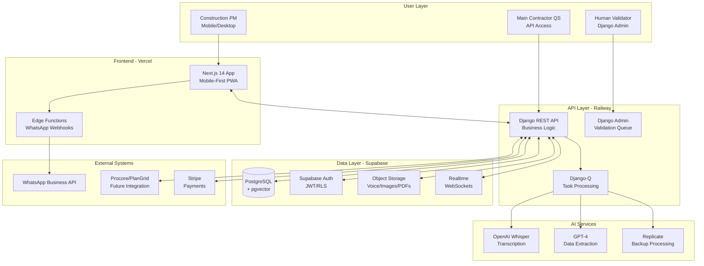

# High Level Architecture

## Technical Summary

The Construction Evidence Machine employs an API-first monolithic architecture with clear service boundaries for future microservices extraction, deployed on Railway (Django backend) and Vercel (Next.js frontend). The system uses Next.js 14 with App Router for mobile-first responsive frontend and Django REST Framework for robust backend API development, integrated through RESTful APIs with real-time updates via Supabase. Core infrastructure leverages Supabase for database (PostgreSQL with pgvector), authentication, storage, and real-time subscriptions, with Railway providing auto-scaling backend deployment. This architecture directly achieves PRD goals by enabling rapid MVP deployment (€45/month) while supporting seamless scaling to 1000+ users (€170/month) and maintaining integration readiness for main contractor systems through comprehensive API documentation.

## Platform and Infrastructure Choice

**Platform:** Hybrid Cloud (Vercel + Railway + Supabase)
**Key Services:** 
- Vercel: Next.js hosting, edge functions, CDN
- Railway: Django backend, auto-scaling, EU regions
- Supabase: PostgreSQL, pgvector, auth, storage, real-time
- OpenAI: Whisper API, GPT-4 for construction NLP
- Replicate: Cost-effective AI backup processing

**Deployment Host and Regions:** 
- Frontend: Vercel Global CDN with EU priority
- Backend: Railway EU-West (Ireland) for data residency
- Database: Supabase EU-West (Dublin) for GDPR compliance

## Repository Structure

**Structure:** Monorepo with clear package boundaries
**Monorepo Tool:** npm workspaces (simplest for MVP, upgrade to Turborepo later)
**Package Organization:** 
- apps/web (Next.js frontend)
- apps/api (Django backend)
- packages/shared (TypeScript interfaces, constants)
- packages/ui (shared React components - future)

## Complete Source Tree

```
construction-evidence-machine/
├── .github/
│   ├── workflows/
│   │   ├── deploy.yaml
│   │   └── test.yaml
│   └── ISSUE_TEMPLATE/
├── .bmad-core/
│   ├── core-config.yaml
│   └── checklists/
│       └── po-master-checklist.md
├── docs/
│   ├── architecture.md                    # This file (shardable)
│   ├── architecture/                      # Sharded architecture files
│   │   ├── coding-standards.md
│   │   ├── tech-stack.md
│   │   └── source-tree.md
│   ├── prd.md                            # Main PRD (shardable)
│   ├── prd/                              # Sharded PRD files
│   │   ├── index.md
│   │   ├── goals-and-background-context.md
│   │   ├── requirements.md
│   │   ├── technical-assumptions.md
│   │   ├── user-interface-design-goals.md
│   │   ├── epic-list.md
│   │   ├── epic-1-foundation-core-infrastructure.md
│   │   ├── epic-2-ai-processing-human-validation.md
│   │   ├── epic-3-evidence-package-generation.md
│   │   ├── epic-4-project-management-archive.md
│   │   ├── mvp-scope-strategy.md
│   │   ├── checklist-results-report.md
│   │   └── next-steps.md
│   ├── front-end-spec.md
│   ├── mvp-implementation-plan.md
│   └── brief.md
├── docs/stories/                          # Individual user stories
│   ├── epic-1/
│   │   ├── story-1-1-project-setup.md
│   │   ├── story-1-2-authentication.md
│   │   ├── story-1-3-project-structure.md
│   │   ├── story-1-4-health-check.md
│   │   └── story-1-5-smart-features.md
│   ├── epic-2/
│   ├── epic-3/
│   └── epic-4/
├── apps/
│   ├── web/                              # Next.js Frontend
│   │   ├── src/
│   │   │   ├── app/                      # App Router structure
│   │   │   │   ├── (auth)/
│   │   │   │   │   ├── login/
│   │   │   │   │   │   └── page.tsx
│   │   │   │   │   ├── register/
│   │   │   │   │   │   └── page.tsx
│   │   │   │   │   └── layout.tsx
│   │   │   │   ├── (dashboard)/
│   │   │   │   │   ├── projects/
│   │   │   │   │   │   ├── page.tsx
│   │   │   │   │   │   └── [id]/
│   │   │   │   │   │       ├── page.tsx
│   │   │   │   │   │       ├── process/
│   │   │   │   │   │       │   └── page.tsx
│   │   │   │   │   │       ├── evidence/
│   │   │   │   │   │       │   └── page.tsx
│   │   │   │   │   │       └── settings/
│   │   │   │   │   │           └── page.tsx
│   │   │   │   │   ├── validation/
│   │   │   │   │   │   └── page.tsx
│   │   │   │   │   └── layout.tsx
│   │   │   │   ├── api/
│   │   │   │   │   ├── webhooks/
│   │   │   │   │   │   └── whatsapp/
│   │   │   │   │   │       └── route.ts
│   │   │   │   │   └── health/
│   │   │   │   │       └── route.ts
│   │   │   │   ├── globals.css
│   │   │   │   ├── layout.tsx
│   │   │   │   └── page.tsx
│   │   │   ├── components/
│   │   │   │   ├── atoms/
│   │   │   │   │   ├── Button/
│   │   │   │   │   │   ├── index.tsx
│   │   │   │   │   │   └── Button.test.tsx
│   │   │   │   │   ├── Input/
│   │   │   │   │   ├── Badge/
│   │   │   │   │   └── Spinner/
│   │   │   │   ├── molecules/
│   │   │   │   │   ├── ConfidenceBadge/
│   │   │   │   │   ├── FileDropZone/
│   │   │   │   │   ├── ProgressIndicator/
│   │   │   │   │   └── AudioPlayer/
│   │   │   │   ├── organisms/
│   │   │   │   │   ├── MessageInput/
│   │   │   │   │   ├── ProcessingView/
│   │   │   │   │   ├── ReviewPanel/
│   │   │   │   │   ├── ValidationQueue/
│   │   │   │   │   └── ProjectDashboard/
│   │   │   │   └── templates/
│   │   │   │       ├── AuthLayout/
│   │   │   │       ├── DashboardLayout/
│   │   │   │       └── ProcessingLayout/
│   │   │   ├── services/
│   │   │   │   ├── api-client.ts
│   │   │   │   ├── projects.service.ts
│   │   │   │   ├── auth.service.ts
│   │   │   │   ├── processing.service.ts
│   │   │   │   └── input-recovery.service.ts
│   │   │   ├── stores/
│   │   │   │   ├── index.ts
│   │   │   │   ├── auth.store.ts
│   │   │   │   └── projects.store.ts
│   │   │   ├── lib/
│   │   │   │   ├── utils.ts
│   │   │   │   ├── constants.ts
│   │   │   │   └── supabase.ts
│   │   │   └── __tests__/
│   │   │       ├── components/
│   │   │       ├── services/
│   │   │       └── utils/
│   │   ├── public/
│   │   │   ├── images/
│   │   │   └── icons/
│   │   ├── package.json
│   │   ├── next.config.js
│   │   ├── tailwind.config.js
│   │   ├── middleware.ts
│   │   └── tsconfig.json
│   └── api/                              # Django Backend
│       ├── api/
│       │   ├── __init__.py
│       │   ├── settings.py
│       │   ├── urls.py
│       │   ├── wsgi.py
│       │   └── asgi.py
│       ├── apps/
│       │   ├── authentication/
│       │   │   ├── __init__.py
│       │   │   ├── models.py
│       │   │   ├── views.py
│       │   │   ├── serializers.py
│       │   │   ├── urls.py
│       │   │   ├── permissions.py
│       │   │   └── tests/
│       │   ├── projects/
│       │   │   ├── __init__.py
│       │   │   ├── models.py
│       │   │   ├── views.py
│       │   │   ├── serializers.py
│       │   │   ├── urls.py
│       │   │   ├── repositories.py
│       │   │   └── tests/
│       │   ├── processing/
│       │   │   ├── __init__.py
│       │   │   ├── models.py
│       │   │   ├── views.py
│       │   │   ├── services.py
│       │   │   ├── tasks.py
│       │   │   ├── urls.py
│       │   │   └── tests/
│       │   ├── validation/
│       │   │   ├── __init__.py
│       │   │   ├── models.py
│       │   │   ├── views.py
│       │   │   ├── admin.py
│       │   │   ├── serializers.py
│       │   │   ├── urls.py
│       │   │   └── tests/
│       │   └── evidence/
│       │       ├── __init__.py
│       │       ├── models.py
│       │       ├── views.py
│       │       ├── builders.py
│       │       ├── serializers.py
│       │       ├── urls.py
│       │       └── tests/
│       ├── core/
│       │   ├── __init__.py
│       │   ├── middleware/
│       │   │   ├── __init__.py
│       │   │   ├── auth.py
│       │   │   └── cors.py
│       │   ├── exceptions/
│       │   │   ├── __init__.py
│       │   │   └── handlers.py
│       │   └── utils/
│       │       ├── __init__.py
│       │       ├── constants.py
│       │       └── helpers.py
│       ├── tests/
│       │   ├── unit/
│       │   ├── integration/
│       │   └── fixtures/
│       │       └── audio_samples/
│       ├── requirements.txt
│       ├── manage.py
│       ├── Dockerfile
│       └── railway.json
├── packages/
│   ├── shared/                           # Shared TypeScript types/constants
│   │   ├── src/
│   │   │   ├── types/
│   │   │   │   ├── index.ts
│   │   │   │   ├── user.ts
│   │   │   │   ├── project.ts
│   │   │   │   ├── processing.ts
│   │   │   │   └── evidence.ts
│   │   │   ├── constants/
│   │   │   │   ├── index.ts
│   │   │   │   └── api.ts
│   │   │   └── utils/
│   │   │       ├── index.ts
│   │   │       └── validation.ts
│   │   ├── package.json
│   │   └── tsconfig.json
│   └── ui/                               # Future shared UI components
│       ├── src/
│       │   ├── components/
│       │   └── styles/
│       ├── package.json
│       └── tsconfig.json
├── e2e/                                  # End-to-end tests
│   ├── auth.spec.ts
│   ├── processing.spec.ts
│   ├── validation.spec.ts
│   ├── evidence.spec.ts
│   └── playwright.config.ts
├── .ai/
│   └── debug-log.md
├── .env.example
├── .env.local
├── .gitignore
├── package.json
├── package-lock.json
├── README.md
├── turbo.json                            # Future Turborepo config
└── docker-compose.yml                   # Local development
```

## Key Directory Explanations

**Documentation Structure:**
- `docs/` contains both monolithic and sharded documentation
- `docs/architecture/` enables future sharding of architecture content
- `docs/prd/` already sharded into focused epic and section files
- `docs/stories/` organizes user stories by epic

**Application Structure:**
- `apps/web/` follows Next.js 14 App Router conventions
- `apps/api/` follows Django best practices with app-based organization
- `packages/shared/` enables type sharing between frontend/backend
- `packages/ui/` prepared for future component sharing

**Development Structure:**
- `e2e/` for Playwright end-to-end testing
- `.github/workflows/` for CI/CD automation
- `.bmad-core/` for BMAD configuration and checklists

## High Level Architecture Diagram



## Architectural Patterns

- **API-First Monolith:** Django monolith with clear REST boundaries for future service extraction - _Rationale:_ Enables rapid MVP development while maintaining clear integration points for main contractor systems
- **Mobile-First Responsive:** Progressive enhancement from 375px base to desktop - _Rationale:_ Construction PMs primarily use mobile devices on-site, desktop is secondary
- **Event-Driven Processing:** Supabase real-time for validation queue updates and processing status - _Rationale:_ Provides immediate feedback during time-critical Friday afternoon workflows
- **Repository Pattern:** Abstract data access through Django ORM and repositories - _Rationale:_ Enables future database migration and testing flexibility
- **Component-Based UI:** Atomic design with React components and TypeScript - _Rationale:_ Ensures consistency and maintainability across the growing UI
- **BFF Pattern (Future):** Next.js API routes as backend-for-frontend - _Rationale:_ Optimizes mobile performance by aggregating API calls
- **Smart Confidence Routing:** Dynamic confidence thresholds based on risk factors - _Rationale:_ Higher stakes require higher confidence; time pressure allows lower confidence
- **Input Recovery Pattern:** LocalStorage backup for critical user inputs - _Rationale:_ Prevents data loss from browser crashes during Friday afternoon rush
- **Progressive Enhancement:** Core functionality works offline, enhanced features require connectivity - _Rationale:_ Ensures basic usability in poor connectivity without complex offline sync
