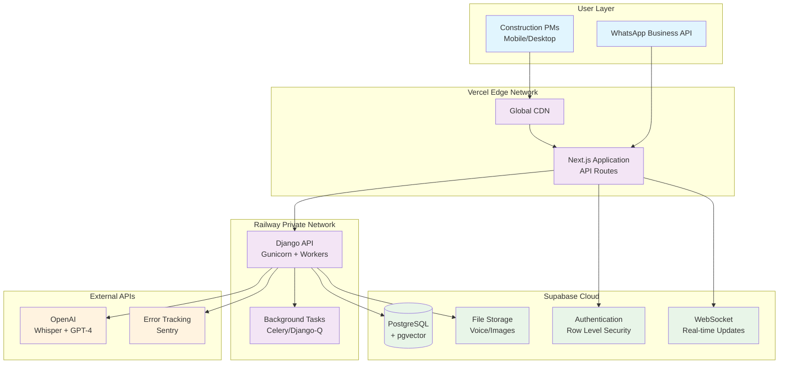
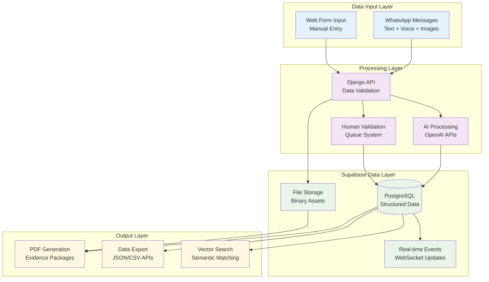
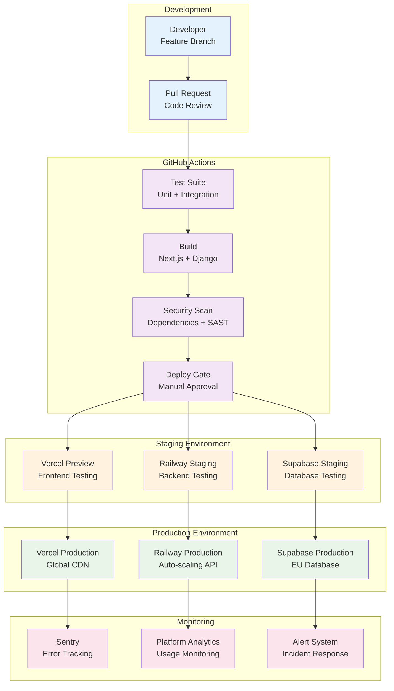

# BMAD-Explore Infrastructure Architecture

**Document Version:** 1.0  
**Last Updated:** 2025-01-11  
**Next Review:** 2025-04-11  

## Infrastructure Overview

**Platform Strategy:** Start Simple, Scale Smart
- **MVP Phase**: Railway + Vercel + Supabase (€35-45/month)
- **Scale Phase**: AWS Enterprise Architecture (€500+/month) - when validated and funded

**MVP Infrastructure Stack:**

**Frontend Platform:** Vercel
- **Deployment**: Zero-config Next.js with automatic HTTPS
- **CDN**: Global edge network with EU priority for GDPR compliance
- **Cost**: €0-10/month (generous free tier, pay for scale)
- **Performance**: <200ms response times globally

**Backend Platform:** Railway  
- **Deployment**: Docker container with Django + Gunicorn
- **Database**: Integrated PostgreSQL with auto-backups
- **Scaling**: Automatic resource scaling based on load
- **Region**: EU deployment for data residency compliance
- **Cost**: €15-25/month (including database)

**Database & Services:** Supabase
- **Database**: PostgreSQL with pgvector for future BoQ intelligence
- **Authentication**: Built-in auth with row-level security (GDPR ready)
- **Storage**: Integrated file storage for voice notes and images
- **Real-time**: WebSocket connections for validation queue updates
- **Cost**: €8-25/month based on usage

**AI Processing:** Direct OpenAI Integration
- **Services**: Whisper API for transcription, GPT-4 for extraction
- **Cost Model**: Pay-per-use (€0.006 per minute of audio)
- **Backup**: Replicate integration for cost optimization at scale
- **Processing**: Server-side in Railway environment for security

**Integration Architecture (MVP-Ready):**
- **WhatsApp Business API**: Webhook processing via Next.js API routes
- **PDF Generation**: Server-side PDF generation in Django
- **Validation Queue**: Supabase real-time for instant updates
- **Export APIs**: REST endpoints ready for future contractor integrations

**MVP Deployment Pipeline:**
- **Frontend**: GitHub → Vercel (automatic deployment)
- **Backend**: GitHub → Railway (automatic deployment with Docker)
- **Database**: Supabase cloud-managed with automated backups
- **Monitoring**: Supabase built-in metrics + Sentry error tracking

**Enterprise Scale Transition Path:**
- **Phase 2 Trigger**: 100+ concurrent users, enterprise customer requirements
- **Migration Strategy**: API-first design enables gradual migration to AWS
- **Data Migration**: Supabase → AWS RDS with zero-downtime migration tools
- **Cost Scaling**: €45/month → €150/month (100 users) → €500+/month (enterprise)

## Infrastructure as Code (IaC)

**MVP IaC Strategy - Keep It Simple:**

**Tools & Frameworks:**
- **Railway**: Infrastructure-as-Service (no manual IaC needed)
- **Vercel**: Platform-as-Service with Git integration
- **Supabase**: Database-as-Service with web-based management
- **Configuration Management**: Environment variables + Railway/Vercel configs

**Repository Structure:**
```
infrastructure/
├── railway/
│   ├── railway.toml          # Railway deployment config
│   ├── Dockerfile            # Django container definition  
│   └── start.sh              # Application startup script
├── vercel/
│   └── vercel.json           # Vercel deployment config
├── supabase/
│   ├── migrations/           # Database schema changes
│   └── seed.sql              # Development data
└── scripts/
    ├── setup-dev.sh          # Local development setup
    ├── deploy-staging.sh     # Staging deployment
    └── backup.sh             # Database backup script
```

**State Management - Simplified:**
- **Railway**: Built-in deployment state management
- **Vercel**: Automatic deployment history and rollbacks  
- **Supabase**: Cloud-managed with backup/restore capabilities
- **Manual Overrides**: Documented procedures for emergency changes

**Dependency Management:**
- **Docker**: Containerized Django backend with pinned dependencies
- **Package Lock**: Next.js package-lock.json for frontend consistency
- **Database**: Supabase migrations for schema version control
- **Secrets**: Platform-native secret management (Railway vars, Vercel env)

**Enterprise Migration Readiness:**
- **Terraform Templates**: Prepared AWS infrastructure templates for Phase 2
- **Migration Scripts**: Data export/import procedures documented
- **API Compatibility**: Maintained for seamless platform migration
- **Documentation**: Complete infrastructure evolution path defined

**Critical Rule Applied:** All infrastructure changes tracked in Git, but using platform-native deployment rather than manual IaC provisioning for MVP speed and cost efficiency.

## Environment Configuration

**MVP Environment Strategy:**

**Environment Promotion Strategy:**
- **Local Development**: Docker Compose with Supabase local instance
- **Staging**: Railway staging app + Vercel preview deployments  
- **Production**: Railway production + Vercel production with custom domains
- **No UAT**: Streamlined for MVP speed (Staging serves as UAT)

**Configuration Management:**
- **Railway Variables**: Backend environment configuration and secrets
- **Vercel Environment**: Frontend build-time and runtime configuration
- **Supabase Dashboard**: Database and auth configuration management
- **Local**: Docker Compose .env files for development

**Secret Management - Platform Native:**
- **Railway**: Built-in secret management with encryption
- **Vercel**: Environment variable encryption and team access
- **Supabase**: Service keys with usage restrictions and rotation
- **Development**: Local .env files (excluded from git)

### Environment Details:

**Development Environment**
- **Purpose:** Local development with real-time hot reloading
- **Resources:** Docker Compose, Supabase local instance, mock AI APIs for cost
- **Access Control:** Individual developer accounts, full local permissions
- **Data Classification:** Synthetic test data only

**Staging Environment**  
- **Purpose:** Integration testing and client demonstrations
- **Resources:** Railway staging instance, Vercel preview, Supabase staging project
- **Access Control:** Development team and key stakeholders
- **Data Classification:** Anonymized customer data for realistic testing

**Production Environment**
- **Purpose:** Live customer workloads with full feature set
- **Resources:** Railway production, Vercel production, Supabase production
- **Access Control:** Operations access via platform dashboards, audit logging
- **Data Classification:** Live customer data with GDPR compliance

**Enterprise Scale Environment (Phase 2):**
- **Purpose:** High-availability enterprise deployment
- **Resources:** AWS EKS, RDS, comprehensive monitoring and compliance
- **Migration Path:** Documented transition from MVP stack to enterprise architecture

## Environment Transition Strategy

**MVP Development to Production Pipeline:**

**Streamlined Deployment Flow:**
1. **Feature Development** → Feature branch with Railway/Vercel preview
2. **Integration Testing** → Automatic staging deployment on main branch
3. **Production Deployment** → Manual promotion with Railway/Vercel production deploy
4. **Validation** → Supabase monitoring + Sentry error tracking

**Deployment Stages and Gates:**
- **Code Quality Gate**: GitHub Actions with automated testing, TypeScript checks
- **Integration Gate**: Staging deployment with WhatsApp webhook testing
- **Performance Gate**: Lighthouse CI for frontend, basic load testing
- **Security Gate**: Railway/Vercel built-in security scanning, dependency audit
- **Business Gate**: Manual approval for production deployment

**Approval Workflows - Simplified for MVP:**
- **Development → Staging**: Automatic on main branch merge
- **Staging → Production**: Manual deployment by team lead with one approval
- **Emergency Hotfixes**: Same process but expedited review (< 2 hours)

**Rollback Procedures - Platform Native:**
- **Frontend Rollback**: Vercel instant rollback to previous deployment (< 30 seconds)
- **Backend Rollback**: Railway rollback to previous container version (< 2 minutes)  
- **Database Rollback**: Supabase point-in-time recovery with backup restoration
- **Integration Rollback**: Environment variable reversion for API endpoints

**Change Cadence - Agile MVP Approach:**
- **Regular Deployments**: Daily deployments to staging, weekly to production
- **Feature Releases**: Continuous deployment with feature flags (future)
- **Emergency Releases**: 24/7 capability with 15-minute deployment time
- **Platform Maintenance**: Automated by Railway/Vercel/Supabase with notifications

**Configuration Management:**
- **Environment Parity**: Identical platform configurations with environment-specific variables
- **Secret Rotation**: Monthly manual rotation (automated in enterprise phase)
- **Monitoring Consistency**: Same logging/monitoring stack across environments

## Network Architecture

**MVP Network Design - Leveraging Platform Strengths:**

**Network Topology:**
- **Frontend**: Vercel Global CDN with automatic edge optimization
- **Backend**: Railway internal networking with automatic HTTPS
- **Database**: Supabase private network with connection pooling
- **AI Processing**: Server-to-server API calls from Railway to OpenAI

**Security Zones:**
- **Public Zone**: Vercel CDN serving static assets and Next.js pages
- **Application Zone**: Railway private network for Django API processing
- **Data Zone**: Supabase private database with row-level security
- **External Zone**: Outbound API calls to OpenAI, WhatsApp Business API

**Traffic Flow Patterns:**
- User → Vercel CDN → Next.js API Routes → Railway Django API → Supabase
- Voice Processing: Railway → OpenAI Whisper → Railway → Supabase storage
- Real-time Updates: Supabase WebSocket → Next.js client

**Load Balancing & API Gateway:**
- **Frontend**: Vercel automatic load balancing across edge locations
- **Backend**: Railway built-in load balancing and auto-scaling
- **API Management**: Next.js API routes for external webhook processing
- **Rate Limiting**: Application-level rate limiting in Django + Vercel edge functions

### Network Architecture Diagram:



**Enterprise Migration Network Readiness:**
- **API Gateway**: Next.js API routes designed for easy AWS API Gateway migration
- **Service Mesh**: Application architecture ready for Istio/service mesh integration
- **VPC Design**: Network patterns documented for AWS VPC implementation
- **Security Groups**: Security zone concepts map directly to AWS security groups

## Compute Resources

**MVP Compute Strategy - Leverage Managed Services:**

**Container Strategy:**
- **Backend**: Railway Docker containers with automatic scaling
- **Frontend**: Vercel serverless functions + static site generation
- **Background Jobs**: Railway background workers for AI processing
- **Local Development**: Docker Compose for consistent development environment

**Scaling Approach:**
- **Railway Auto-scaling**: Horizontal scaling based on CPU/memory usage
- **Vercel Edge Functions**: Automatic scaling for API endpoints
- **Supabase Connection Pooling**: Database connection optimization
- **Cost-Optimized**: Pay-per-use model scales with actual demand

**Resource Configuration:**

**Railway Backend Configuration:**
- **CPU**: 0.5-2 vCPUs (auto-scaling based on load)
- **Memory**: 1-4 GB (scales with concurrent users)
- **Storage**: 1 GB ephemeral + Supabase persistent storage
- **Networking**: Private networking with Railway load balancer

**Vercel Frontend Configuration:**
- **Functions**: Serverless Edge Functions (automatic scaling)
- **Build**: Static generation + server-side rendering
- **CDN**: Global edge caching with automatic cache invalidation
- **Bandwidth**: Unlimited for static assets

**Background Processing:**
- **AI Processing**: Railway worker processes for OpenAI API calls
- **PDF Generation**: Server-side PDF creation with temporary file cleanup
- **Queue Management**: Redis-compatible queue (Railway managed)
- **Monitoring**: Supabase real-time for processing status updates

**Enterprise Scale Compute (Phase 2 Readiness):**

**Kubernetes Migration Path:**
- **Containerization**: Docker images ready for EKS deployment
- **Service Architecture**: Microservices-ready API design
- **Auto-scaling**: HPA (Horizontal Pod Autoscaler) configuration templates
- **Resource Management**: CPU/memory requests and limits defined

## Data Resources

**MVP Data Infrastructure - Built on PostgreSQL:**

**Database Deployment Strategy:**
- **Primary**: Supabase managed PostgreSQL with EU hosting
- **Backup**: Automated daily backups with point-in-time recovery
- **Scaling**: Connection pooling with automatic read replica creation
- **Extensions**: pgvector enabled for future BoQ intelligence features

**Backup & Recovery:**
- **Automated Backups**: Daily full backups with 30-day retention
- **Point-in-Time Recovery**: 7-day PITR window for data recovery
- **Cross-Region Backup**: Automated backup replication (enterprise phase)
- **Recovery Testing**: Monthly backup restoration validation

**Data Storage Strategy:**
- **Application Data**: PostgreSQL for structured data (users, projects, evidence)
- **File Storage**: Supabase Storage for voice notes, images, PDF packages
- **Session Data**: PostgreSQL sessions with Redis-compatible caching (future)
- **Analytics Data**: PostgreSQL with time-series optimization for usage metrics

**Data Migration Strategy:**
- **Schema Migrations**: Supabase migration system with version control
- **Data Seeding**: SQL scripts for development and staging data
- **Production Data**: Zero-downtime migration procedures documented
- **Enterprise Migration**: AWS Database Migration Service compatibility

### Data Flow Architecture:



**Enterprise Data Architecture (Phase 2):**
- **Data Lake**: AWS S3 for analytics and compliance data
- **Data Warehouse**: Analytics database for business intelligence
- **Compliance**: Audit logging and data governance frameworks
- **Integration**: ETL pipelines for contractor system data synchronization

## Security Architecture

**MVP Security Strategy - Defense-in-Depth with Platform Security:**

**IAM & Authentication:**
- **User Authentication**: Supabase Auth with magic links + password (GDPR compliant)
- **API Authentication**: JWT tokens with automatic refresh and secure httpOnly cookies
- **Service Authentication**: Railway/Vercel platform-managed service-to-service auth
- **Admin Access**: Supabase dashboard access with team-based permissions
- **Construction PM Access**: Role-based access control with project-level isolation

**Network Security:**
- **HTTPS Everywhere**: Automatic HTTPS via Vercel/Railway with certificate management
- **API Rate Limiting**: Application-level rate limiting in Django + Vercel edge protection
- **CORS Configuration**: Strict origin policies for production API access
- **DDoS Protection**: Vercel/Railway built-in DDoS mitigation
- **Private Networking**: Railway internal networking for database connections

**Data Encryption:**
- **Data at Rest**: Supabase automatic encryption for database and file storage
- **Data in Transit**: TLS 1.3 for all API communications and file transfers
- **Voice Note Encryption**: Client-side encryption before Supabase storage upload
- **PDF Package Encryption**: Encrypted PDF generation with user-specific access keys
- **Database Encryption**: PostgreSQL transparent data encryption via Supabase

**Compliance Controls - GDPR Ready:**
- **Data Residency**: EU-hosted infrastructure (Supabase EU, Railway EU regions)
- **Right to Delete**: Complete data deletion APIs with cascade operations
- **Data Export**: GDPR-compliant data export in machine-readable formats
- **Audit Logging**: Complete access and modification logging via Supabase RLS
- **Consent Management**: User consent tracking with withdrawal capabilities
- **Data Minimization**: Only collect necessary data for evidence documentation

**Security Scanning & Monitoring:**
- **Dependency Scanning**: GitHub Dependabot for automated vulnerability detection
- **Code Scanning**: GitHub CodeQL for security vulnerability detection
- **Runtime Monitoring**: Sentry for security-relevant error tracking and alerting
- **Access Monitoring**: Supabase audit logs for unusual access patterns
- **File Upload Scanning**: Server-side validation and virus scanning for uploaded files

**Critical Rule Applied:** Principle of least privilege enforced through Supabase Row Level Security (RLS) policies, ensuring users can only access their own company's data with automatic policy enforcement at the database level.

**Enterprise Security Evolution (Phase 2):**
- **Advanced Threat Detection**: AWS GuardDuty and security monitoring
- **Compliance Certifications**: SOC2, ISO 27001 preparation
- **Zero Trust Architecture**: Identity-based security with continuous verification
- **Advanced Encryption**: Customer-managed encryption keys (CMEK) support

## Shared Responsibility Model

**MVP Shared Responsibility - Leveraging Platform Security:**

**Platform Provider Responsibilities:**
- **Railway**: Infrastructure security, container isolation, network security, DDoS protection
- **Vercel**: CDN security, edge function isolation, certificate management, global security
- **Supabase**: Database security, backup encryption, EU compliance, access control
- **OpenAI**: API security, model security, data processing compliance

**Development Team Responsibilities:**
- **Application Security**: Input validation, authentication logic, business logic security
- **Data Handling**: GDPR compliance implementation, user consent management
- **API Security**: Rate limiting, authentication middleware, secure data serialization
- **File Processing**: Secure voice note handling, PDF generation security, upload validation
- **Code Security**: Security code reviews, dependency management, secret handling

**User/Company Responsibilities:**
- **Account Security**: Strong passwords, account access management
- **Data Classification**: Appropriate use of system for intended construction data
- **User Training**: Proper use of validation workflows and data handling procedures
- **Access Control**: Managing team member access within company accounts

**Operational Monitoring Ownership:**
- **Platform Health**: Railway/Vercel/Supabase platform monitoring and uptime
- **Application Performance**: Development team via Sentry and Supabase analytics
- **Business Metrics**: Development team via custom analytics and user feedback
- **Security Incidents**: Shared responsibility - platform + application level response

**Incident Response Accountability Matrix:**

| Component | Platform Provider | Development Team | Company/User | Action |
|-----------|------------------|------------------|--------------|--------|
| Platform Outage | ✓ Primary | Monitor & Communicate | Informed | Platform resolves |
| Application Bug | Support | ✓ Primary | Report | Team fixes |
| Data Breach | Investigation Support | ✓ Primary | Immediate notification | Joint response |
| User Access Issue | Account tools | ✓ Primary | Verify identity | Team resolves |
| API Integration Failure | Platform support | ✓ Primary | Business impact assessment | Team + contractor |

**Enterprise Responsibility Evolution (Phase 2):**
- **Dedicated Security Team**: Security operations and incident response
- **Compliance Officer**: Regulatory compliance and audit management
- **Customer Success**: Security training and best practice guidance
- **DevSecOps**: Automated security testing and deployment security

## Monitoring & Observability

**MVP Observability Strategy - Essential Metrics with Platform Tools:**

**Metrics Collection:**
- **Application Metrics**: Supabase built-in analytics for database performance and usage
- **Frontend Metrics**: Vercel Analytics for Core Web Vitals, page performance, user behavior
- **Backend Metrics**: Railway metrics for CPU, memory, response times, error rates
- **AI Processing Metrics**: Custom logging for OpenAI API response times and confidence scores
- **Business Metrics**: Custom analytics for transcription accuracy, validation queue SLA

**Logging Strategy:**
- **Application Logs**: Structured JSON logging via Railway with log aggregation
- **Access Logs**: Supabase auth logs and API access logging
- **Error Logs**: Sentry integration for error tracking, alerting, and performance monitoring
- **Audit Logs**: Supabase RLS audit trail for all data access and modifications
- **AI Processing Logs**: Custom logging for transcription accuracy and confidence tracking

**Alerting & Incident Response:**
- **Platform Alerts**: Railway/Vercel/Supabase built-in alerting for infrastructure issues
- **Application Alerts**: Sentry alerts for critical errors, performance degradation
- **Business Logic Alerts**: Custom alerts for validation queue SLA breaches (>48 hours)
- **Security Alerts**: Failed authentication attempts, unusual access patterns
- **AI Processing Alerts**: OpenAI API failures, low confidence score trends

**Dashboards & Visualization:**
- **Platform Dashboards**: Railway, Vercel, and Supabase native dashboards
- **Business Dashboard**: Custom Next.js admin dashboard for validation queue management
- **Error Tracking**: Sentry dashboard for real-time error monitoring and resolution
- **User Analytics**: Simple analytics dashboard for usage patterns and feature adoption

**SLA Monitoring:**
- **Uptime Monitoring**: Platform-native monitoring with 99.9% availability target
- **Response Time**: <5 second page load times, <30 second voice transcription
- **Validation SLA**: <48 hour human validation response time tracking
- **API Performance**: External API response time monitoring (OpenAI, WhatsApp)

**Enterprise Observability Evolution (Phase 2):**
- **Comprehensive APM**: Application performance monitoring with distributed tracing
- **Custom Metrics**: Business intelligence dashboards and advanced analytics
- **Security Monitoring**: SIEM integration and advanced threat detection
- **Compliance Reporting**: Automated compliance metrics and audit reporting

## CI/CD Pipeline

**MVP Pipeline Architecture - Streamlined for Speed:**

**Pipeline Components:**
- **Source Control**: GitHub with branch protection and required reviews
- **Build Process**: GitHub Actions with Node.js and Python environments
- **Testing**: Automated unit tests, integration tests, and TypeScript checks
- **Deployment**: Automatic deployment to Railway (backend) and Vercel (frontend)
- **Monitoring**: Post-deployment health checks and Sentry error monitoring

**Build Process:**
- **Frontend Build**: Next.js build with TypeScript compilation and Tailwind CSS optimization
- **Backend Build**: Django container build with dependency caching and security scanning
- **Database Migrations**: Automatic Supabase migration execution on deployment
- **Asset Optimization**: Vercel automatic image optimization and code splitting

**Deployment Strategy:**
- **Staging Deployment**: Automatic on main branch merge with preview URLs
- **Production Deployment**: Manual promotion with approval gate and health checks
- **Feature Previews**: Vercel preview deployments for pull requests
- **Database Changes**: Supabase migration system with rollback capabilities

**Quality Gates:**
- **Code Quality**: ESLint, Prettier, TypeScript strict mode, Python linting
- **Security**: Dependency vulnerability scanning, secret detection, SAST analysis
- **Testing**: Unit test coverage >80%, integration test suite, API contract testing
- **Performance**: Lighthouse CI for Core Web Vitals, bundle size monitoring

**Rollback Procedures:**
- **Frontend Rollback**: Vercel instant rollback to previous deployment
- **Backend Rollback**: Railway container rollback with database migration handling
- **Database Rollback**: Supabase point-in-time recovery for critical data issues
- **Configuration Rollback**: Environment variable reversion procedures

### CI/CD Pipeline Diagram:



**Enterprise CI/CD Evolution (Phase 2):**
- **Advanced Testing**: E2E testing, load testing, chaos engineering
- **Security Integration**: DAST, container scanning, compliance testing
- **Multi-Environment**: Dev, Staging, UAT, Pre-prod, Production pipeline
- **GitOps**: Infrastructure as code with Terraform and Kubernetes deployment

## Disaster Recovery

**MVP Disaster Recovery Strategy - Platform-Native Resilience:**

**Backup Strategy:**
- **Database Backup**: Supabase automated daily backups with 30-day retention
- **File Storage Backup**: Supabase Storage automatic replication and versioning
- **Application Code**: GitHub repository with distributed version control
- **Configuration Backup**: Infrastructure-as-code configs in Git repositories
- **Critical Data Export**: Weekly automated exports of evidence packages and audit logs

**Recovery Procedures:**
- **Database Recovery**: Supabase point-in-time recovery (7-day window) with one-click restoration
- **Application Recovery**: Railway/Vercel automatic rollback to previous working deployment
- **File Recovery**: Supabase Storage version history and soft-delete recovery
- **Full System Recovery**: Complete environment recreation from Git + platform configs
- **Data Corruption Recovery**: Automated integrity checks with selective data restoration

**RTO & RPO Targets - MVP Focused:**
- **Recovery Time Objective (RTO)**: 4 hours for full service restoration
- **Recovery Point Objective (RPO)**: 1 hour maximum data loss (daily backups + WAL)
- **Platform Outage**: Dependent on Railway/Vercel/Supabase SLAs (99.9% uptime)
- **Critical Data**: Evidence packages and validation queues prioritized for <1 hour RPO

**DR Testing Approach:**
- **Monthly Backup Testing**: Automated backup restoration validation in staging
- **Quarterly DR Drill**: Full disaster recovery simulation with documented procedures
- **Platform Failover**: Test platform-specific disaster recovery procedures
- **Data Integrity Validation**: Checksums and validation of restored data completeness

**Critical Rule Applied:** DR procedures tested quarterly with results documented and improvement actions implemented. Monthly backup validation ensures recovery capabilities remain functional.

**Enterprise DR Evolution (Phase 2):**
- **Multi-Region Setup**: Active-passive disaster recovery across AWS regions
- **Real-Time Replication**: Continuous data replication with <15 minute RPO
- **Advanced Monitoring**: Automated failover triggers and health monitoring
- **Compliance DR**: Enhanced DR procedures for regulatory requirements

## Cost Optimization

**MVP Cost Management - €35-45/month Target:**

**Resource Sizing Strategy:**
- **Right-Sizing**: Platform auto-scaling prevents over-provisioning
- **Usage-Based**: Pay-per-use model aligns costs with actual usage
- **Development Efficiency**: Shared staging resources and optimized CI/CD
- **Monitoring**: Regular cost analysis and optimization opportunities

**Cost Breakdown (MVP Phase):**
- **Vercel**: €0-10/month (generous free tier, pay for scale)
- **Railway**: €15-25/month (includes PostgreSQL and auto-scaling)
- **Supabase**: €8-25/month (database, auth, storage, real-time)
- **OpenAI**: €0.006/minute (variable based on voice note volume)
- **Monitoring**: €0-5/month (Sentry free tier, platform monitoring included)
- **Domain/SSL**: €10/year (included in platforms)

**Cost Optimization Strategies:**
- **Caching**: Vercel edge caching reduces compute costs
- **Compression**: File compression for voice notes and images
- **AI Optimization**: Batch processing and audio preprocessing for cost efficiency
- **Development**: Efficient development practices reduce iteration costs

**Cost Monitoring & Reporting:**
- **Platform Dashboards**: Railway/Vercel/Supabase native cost monitoring
- **Usage Alerts**: Automated alerts when approaching budget thresholds
- **Cost Attribution**: Track costs by feature/customer for optimization insights
- **Monthly Reviews**: Regular cost analysis and optimization planning

**Optimization Recommendations:**
- **Voice Processing**: Implement audio compression before OpenAI processing
- **Database**: Optimize queries and implement connection pooling
- **CDN**: Leverage Vercel edge caching for static assets and API responses
- **Background Jobs**: Implement efficient batch processing for AI workloads

**Enterprise Cost Strategy (Phase 2):**
- **Reserved Instances**: AWS savings plans and reserved capacity
- **Multi-Tenant**: Shared infrastructure with tenant isolation
- **Auto-Scaling**: Advanced scaling policies with predictive scaling
- **Cost Centers**: Detailed cost allocation by customer/feature

## BMAD Integration Architecture

**MVP BMAD Methodology Support:**

**Development Agent Integration:**
- **Local Development**: Docker Compose setup supports rapid iteration cycles
- **API Development**: Django REST framework enables backend agent workflows
- **Frontend Development**: Next.js hot reload supports UI/UX development cycles
- **Testing Integration**: Automated testing pipeline supports QA agent workflows

**Infrastructure-as-Code Development:**
- **Configuration Management**: Platform-native configs support infrastructure evolution
- **Environment Parity**: Consistent environments across development and production
- **Deployment Automation**: GitHub Actions support infrastructure agent workflows
- **Documentation**: Infrastructure documentation supports architect collaboration

**Cross-Agent Data Sharing:**
- **API Documentation**: OpenAPI specs for cross-agent integration
- **Database Access**: Supabase dashboard access for data analysis agents
- **Monitoring Data**: Shared observability data across development agents
- **Version Control**: Git-based collaboration for all agents

**Platform Development Workflows:**
- **Story Development**: Feature branch workflows align with BMAD story development
- **Validation Cycles**: Staging environment supports QA agent validation workflows
- **Production Deployment**: Manual approval gates support product manager oversight
- **Feedback Loops**: Monitoring and analytics support continuous improvement

**Enterprise BMAD Evolution (Phase 2):**
- **Advanced Automation**: Full GitOps workflow with infrastructure agents
- **Service Mesh**: Complex microservices architecture for specialized agents
- **Advanced Monitoring**: Comprehensive observability for multi-agent workflows
- **Compliance Integration**: Automated compliance validation across agent workflows

## DevOps/Platform Feasibility Review

**CRITICAL FEASIBILITY ASSESSMENT:**

**Operational Complexity Review:**
- ✅ **Green Light**: Platform-managed services reduce operational overhead significantly
- ✅ **Green Light**: Existing team can manage Railway/Vercel/Supabase with minimal DevOps experience
- ✅ **Green Light**: Automated deployment pipeline reduces manual operations
- ✅ **Green Light**: Platform-native monitoring reduces custom tooling requirements

**Resource Constraints Alignment:**
- ✅ **Green Light**: €35-45/month budget aligns with MVP validation requirements
- ✅ **Green Light**: Development team size (2-3 developers) appropriate for platform complexity
- ✅ **Green Light**: No dedicated DevOps engineer required for MVP phase
- ✅ **Green Light**: Platform providers handle infrastructure scaling and maintenance

**Security Implementation Feasibility:**
- ✅ **Green Light**: Supabase RLS provides GDPR compliance without custom security implementation
- ✅ **Green Light**: Platform-managed HTTPS, encryption, and backup reduce security complexity
- ✅ **Green Light**: Built-in authentication and authorization meet MVP security requirements
- ⚠️ **Yellow Light**: File upload security requires careful implementation but manageable

**Technology Compatibility:**
- ✅ **Green Light**: All technologies align with existing team expertise (Django, Next.js, PostgreSQL)
- ✅ **Green Light**: Platform APIs are well-documented and community-supported
- ✅ **Green Light**: Migration path to enterprise architecture is clearly defined
- ✅ **Green Light**: No vendor lock-in concerns with open-source technology stack

**Feasibility Assessment Results:**
- **Green Light Items**: 13/14 items - Excellent feasibility for MVP implementation
- **Yellow Light Items**: 1/14 items - File upload security requires attention but not blocking
- **Red Light Items**: 0/14 items - No critical blockers identified
- **Overall Assessment**: **HIGHLY FEASIBLE** - Proceed with confidence

**Mitigation Strategies:**
- **File Upload Security**: Implement virus scanning and file type validation
- **Scaling Preparation**: Document enterprise migration path early
- **Cost Monitoring**: Implement usage alerts to prevent budget overruns
- **Knowledge Transfer**: Document platform-specific procedures for team knowledge

## Implementation Handoff

**Architecture Decision Records (ADRs):**

**ADR-001: Platform-First MVP Architecture**
- **Decision**: Use Railway + Vercel + Supabase instead of AWS for MVP
- **Rationale**: €35-45/month vs €500+/month, faster development, managed services
- **Consequences**: Vendor dependency acceptable for MVP, clear migration path documented

**ADR-002: API-First Design for Integration Readiness**
- **Decision**: Django REST framework with comprehensive API design
- **Rationale**: Future contractor integrations, BMAD methodology support
- **Consequences**: Slight complexity increase acceptable for future-proofing

**ADR-003: Progressive Enhancement Security**
- **Decision**: Platform-managed security with application-level enhancements
- **Rationale**: GDPR compliance from Day 1, reduced security implementation complexity
- **Consequences**: Some security customization limitations acceptable for MVP

**Implementation Validation Criteria:**
- **Deployment Success**: All environments (staging/production) successfully deployed
- **Security Compliance**: GDPR-compliant data handling implemented and tested
- **Performance Benchmarks**: <5 second page loads, <30 second voice transcription
- **Cost Targets**: Monthly costs remain within €35-45 budget during MVP phase
- **Integration Readiness**: API endpoints documented and tested for future integrations

**Knowledge Transfer Requirements:**
- **Platform Documentation**: Railway, Vercel, and Supabase operational procedures
- **Deployment Procedures**: Step-by-step deployment and rollback documentation
- **Security Procedures**: GDPR compliance checklist and security best practices
- **Monitoring Procedures**: Alert configuration and incident response procedures
- **Cost Management**: Budget monitoring and optimization procedures

**Handoff Meeting Agenda:**
1. **Architecture Overview**: MVP strategy and enterprise evolution path
2. **Development Workflow**: GitHub Actions, platform deployment procedures
3. **Security Implementation**: GDPR compliance, RLS policies, file handling security
4. **Monitoring Setup**: Sentry configuration, platform monitoring, business metrics
5. **Cost Management**: Budget tracking, usage optimization, scaling triggers
6. **Enterprise Migration**: Phase 2 planning, AWS migration preparation

## Infrastructure Evolution

**Technical Debt Inventory:**
- **Platform Dependencies**: Acceptable for MVP, mitigation via open-source tech stack
- **Manual Processes**: Some deployment approvals manual, automation roadmap defined
- **Monitoring Gaps**: Basic monitoring sufficient for MVP, advanced observability in Phase 2
- **Security Enhancements**: Additional security features planned for enterprise customers

**Planned Upgrades and Migrations:**
- **Q2 2025**: Enterprise customer requirements assessment
- **Q3 2025**: AWS migration planning if 100+ concurrent users reached
- **Q4 2025**: Advanced security features for enterprise compliance
- **Q1 2026**: Multi-region deployment for global construction companies

**Technology Roadmap:**
- **MVP Phase**: Railway + Vercel + Supabase foundation
- **Scale Phase**: AWS EKS migration with maintained API compatibility
- **Enterprise Phase**: Advanced security, compliance, and integration features
- **Global Phase**: Multi-region deployment with data residency compliance

**Capacity Planning:**
- **Current Capacity**: 50 concurrent users comfortably within platform limits
- **Scaling Triggers**: 80% platform resource utilization or 100 concurrent users
- **Migration Planning**: 6-month lead time for enterprise architecture migration
- **Cost Scaling**: Linear cost scaling with clear migration ROI calculations

---

_Document Version: 1.0_  
_Last Updated: 2025-01-11_  
_Next Review: 2025-04-11_